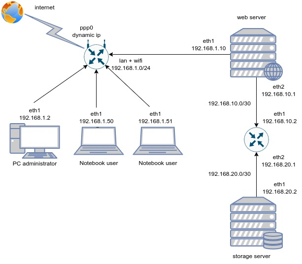

DevOps-netology-23
Vedernikov Alexandr
Домашнее задание к занятию "3.8. Компьютерные сети, лекция 3"

**1. Подключитесь к публичному маршрутизатору в интернет. Найдите маршрут к вашему 
публичному IP**
telnet route-views.routeviews.org  
Username: rviews  
show ip route x.x.x.x/32  
show bgp x.x.x.x/32  

Решение:

>route-views>show ip route 46.236.189.80               
>Routing entry for 46.236.188.0/22  
>  Known via "bgp 6447", distance 20, metric 0  
>  Tag 6939, type external  
>  Last update from 64.71.137.241 3w5d ago  
>  Routing Descriptor Blocks:  
>  64.71.137.241, from 64.71.137.241, 3w5d ago  
>      Route metric is 0, traffic share count is 1  
>      AS Hops 3  
>      Route tag 6939  
>      MPLS label: none  

>route-views>show bgp 46.236.189.80       
>BGP routing table entry for 46.236.188.0/22, version 2533227287  
>Paths: (23 available, best #17, table default)  
>  Not advertised to any peer  
>  Refresh Epoch 1  
>  3267 9049 57044  
>    194.85.40.15 from 194.85.40.15 (185.141.126.1)  
>      Origin IGP, metric 0, localpref 100, valid, external  
>      path 7FE13DBD9128 RPKI State not found  
>      rx pathid: 0, tx pathid: 0  
>  Refresh Epoch 1  
>  7018 1299 9049 57044  
>    12.0.1.63 from 12.0.1.63 (12.0.1.63)  
>      Origin IGP, localpref 100, valid, external  
>      Community: 7018:5000 7018:37232  
>      path 7FE16CAA0248 RPKI State not found  
>      rx pathid: 0, tx pathid: 0  
>  Refresh Epoch 1  
>  701 1299 9049 57044  
>    137.39.3.55 from 137.39.3.55 (137.39.3.55)  
>      Origin IGP, localpref 100, valid, external  
>      path 7FE0AEA9F9F0 RPKI State not found  
>      rx pathid: 0, tx pathid: 0  
>  Refresh Epoch 1  
>  8283 1299 9049 57044  
>    94.142.247.3 from 94.142.247.3 (94.142.247.3)  
>      Origin IGP, metric 0, localpref 100, valid, external  
>      Community: 1299:30000 8283:1 8283:101  
>      unknown transitive attribute: flag 0xE0 type 0x20 length 0x18  
>        value 0000 205B 0000 0000 0000 0001 0000 205B  
>              0000 0005 0000 0001   
>      path 7FE10FA6A838 RPKI State not found  
>      rx pathid: 0, tx pathid: 0  
>  Refresh Epoch 1  
>  57866 1299 9049 57044  
>    37.139.139.17 from 37.139.139.17 (37.139.139.17)  
>      Origin IGP, metric 0, localpref 100, valid, external  
>      Community: 1299:30000 57866:100 65100:1299 65103:3 65104:31    
>      unknown transitive attribute: flag 0xE0 type 0x20 length 0x30    
>        value 0000 E20A 0000 0064 0000 0513 0000 E20A    
>              0000 0065 0000 0064 0000 E20A 0000 0067    
>              0000 0003 0000 E20A 0000 0068 0000 001F
>      path 7FE0BCD1ECF0 RPKI State not found  
>      rx pathid: 0, tx pathid: 0  
>  Refresh Epoch 1  
>  3333 1257 1299 9049 57044  
>    193.0.0.56 from 193.0.0.56 (193.0.0.56)  
>      Origin IGP, localpref 100, valid, external  
>      Community: 1257:50 1257:51 1257:2000 1257:3528 1257:4103  
>      path 7FE1242F6FB8 RPKI State not found  
>      rx pathid: 0, tx pathid: 0  
>  Refresh Epoch 1  
>  20912 3257 1299 9049 57044  
>    212.66.96.126 from 212.66.96.126 (212.66.96.126)  
>      Origin IGP, localpref 100, valid, external  
>      Community: 3257:8101 3257:30055 3257:50001 3257:53900 3257:53902 20912:65004  
>      path 7FE09AFA3B30 RPKI State not found  
>      rx pathid: 0, tx pathid: 0  
>  Refresh Epoch 1  
>  3356 1299 9049 57044  
>    4.68.4.46 from 4.68.4.46 (4.69.184.201)  
>      Origin IGP, metric 0, localpref 100, valid, external  
>      Community: 3356:3 3356:22 3356:86 3356:575 3356:666 3356:903 3356:2012  
>      path 7FE16B25CD48 RPKI State not found  
>      rx pathid: 0, tx pathid: 0  
>  Refresh Epoch 1  
>  3549 3356 1299 9049 57044  
>    208.51.134.254 from 208.51.134.254 (67.16.168.191)  
>      Origin IGP, metric 0, localpref 100, valid, external  
>      Community: 3356:3 3356:22 3356:86 3356:575 3356:666 3356:903 3356:2011 3549:2581 
> 3549:30840  
>      path 7FE105C21E28 RPKI State not found  
>      rx pathid: 0, tx pathid: 0  
>  Refresh Epoch 1  
>  3561 209 3356 1299 9049 57044  
>    206.24.210.80 from 206.24.210.80 (206.24.210.80)  
>      Origin IGP, localpref 100, valid, external  
>      path 7FE10B31BA10 RPKI State not found  
>      rx pathid: 0, tx pathid: 0  
>  Refresh Epoch 1  
>  19214 174 1299 9049 57044  
>    208.74.64.40 from 208.74.64.40 (208.74.64.40)  
>      Origin IGP, localpref 100, valid, external  
>      Community: 174:21000 174:22013  
>      path 7FE118569490 RPKI State not found  
>      rx pathid: 0, tx pathid: 0  
>  Refresh Epoch 1  
>  101 3356 1299 9049 57044  
>    209.124.176.223 from 209.124.176.223 (209.124.176.223)  
>      Origin IGP, localpref 100, valid, external  
>      Community: 101:20100 101:20110 101:22100 3356:3 3356:22 3356:86 3356:575 3356:666 3356:903 3356:2012  
>      Extended Community: RT:101:22100  
>      path 7FE13EED7D88 RPKI State not found  
>      rx pathid: 0, tx pathid: 0  
>  Refresh Epoch 1  
>  7660 2516 1299 9049 57044  
>    203.181.248.168 from 203.181.248.168 (203.181.248.168)  
>      Origin IGP, localpref 100, valid, external  
>      Community: 2516:1030 7660:9003  
>      path 7FE1005257B8 RPKI State not found  
>      rx pathid: 0, tx pathid: 0  
>  Refresh Epoch 2  
>  2497 1299 9049 57044  
>    202.232.0.2 from 202.232.0.2 (58.138.96.254)  
>      Origin IGP, localpref 100, valid, external  
>      path 7FE0C6326760 RPKI State not found  
>      rx pathid: 0, tx pathid: 0  
>  Refresh Epoch 1  
>  4901 6079 1299 9049 57044  
>    162.250.137.254 from 162.250.137.254 (162.250.137.254)  
>      Origin IGP, localpref 100, valid, external  
>      Community: 65000:10100 65000:10300 65000:10400  
>      path 7FE0E7A99DB8 RPKI State not found  
>      rx pathid: 0, tx pathid: 0  
>  Refresh Epoch 1  
>  20130 6939 9049 57044  
>    140.192.8.16 from 140.192.8.16 (140.192.8.16)  
>      Origin IGP, localpref 100, valid, external  
>      path 7FE0E95EBC88 RPKI State not found  
>      rx pathid: 0, tx pathid: 0  
>  Refresh Epoch 1  
>  6939 9049 57044  
>    64.71.137.241 from 64.71.137.241 (216.218.252.164)  
>      Origin IGP, localpref 100, valid, external, best  
>      path 7FE0AADC91F0 RPKI State not found  
>      rx pathid: 0, tx pathid: 0x0  
>  Refresh Epoch 1  
>  53767 14315 174 1299 9049 57044  
>    162.251.163.2 from 162.251.163.2 (162.251.162.3)  
>      Origin IGP, localpref 100, valid, external  
>      Community: 14315:5000 53767:5000  
>      path 7FE007323968 RPKI State not found  
>      rx pathid: 0, tx pathid: 0  
>  Refresh Epoch 1  
>  1351 6939 9049 57044  
>    132.198.255.253 from 132.198.255.253 (132.198.255.253)  
>      Origin IGP, localpref 100, valid, external  
>      path 7FE0F1CA0050 RPKI State not found  
>      rx pathid: 0, tx pathid: 0  
>  Refresh Epoch 1  
>  3303 6939 9049 57044  
>    217.192.89.50 from 217.192.89.50 (138.187.128.158)  
>      Origin IGP, localpref 100, valid, external  
>      Community: 3303:1006 3303:1021 3303:1030 3303:3067 6939:7337 6939:8752 6939:9002  
>      path 7FE182F68868 RPKI State not found  
>      rx pathid: 0, tx pathid: 0  
>  Refresh Epoch 1  
>  852 1299 9049 57044  
>    154.11.12.212 from 154.11.12.212 (96.1.209.43)  
>      Origin IGP, metric 0, localpref 100, valid, external  
>      path 7FE100DF6220 RPKI State not found  
>      rx pathid: 0, tx pathid: 0  
>  Refresh Epoch 1  
>  3257 1299 9049 57044  
>    89.149.178.10 from 89.149.178.10 (213.200.83.26)  
>      Origin IGP, metric 10, localpref 100, valid, external  
>      Community: 3257:8794 3257:30052 3257:50001 3257:54900 3257:54901  
>      path 7FE0D5072058 RPKI State not found  
>      rx pathid: 0, tx pathid: 0  
>  Refresh Epoch 1  
>  49788 1299 9049 57044  
>    91.218.184.60 from 91.218.184.60 (91.218.184.60)  
>      Origin IGP, localpref 100, valid, external  
>      Community: 1299:30000  
>      Extended Community: 0x43:100:1  
>      path 7FE166CD8328 RPKI State not found  
>      rx pathid: 0, tx pathid: 0  

**Создайте dummy0 интерфейс в Ubuntu. Добавьте несколько статических маршрутов. Проверьте 
таблицу маршрутизации.**

Решение:

Таблица маршрутизации до начала.

>vagrant@vagrant:~$ ip route  
>default via 10.0.2.2 dev eth0 proto dhcp src 10.0.2.15 metric 100   
>default via 192.168.1.1 dev eth1 proto dhcp src 192.168.1.83 metric 100   
>10.0.2.0/24 dev eth0 proto kernel scope link src 10.0.2.15   
>10.0.2.2 dev eth0 proto dhcp scope link src 10.0.2.15 metric 100   
>192.168.1.0/24 dev eth1 proto kernel scope link src 192.168.1.83   
>192.168.1.1 dev eth1 proto dhcp scope link src 192.168.1.83 metric 100   
                                                                         
Загрузим модуль "dummy":

>vagrant@vagrant:~$ sudo modprobe -v dummy numdummies=1  
insmod /lib/modules/5.4.0-110-generic/kernel/drivers/net/dummy.ko numdummies=0 numdummies=1  

Проверим загрузился ли модуль:

>vagrant@vagrant:~$ lsmod | grep dummy  
>dummy                  16384  0  

Добавим адрес к интерфейсу "dummy0"

>vagrant@vagrant:~$ sudo ip addr add 192.168.100.150/24 dev dummy0

Проверяем состояние сетевых интерфейсов:

>vagrant@vagrant:~$ ip add  
>1: lo: <LOOPBACK,UP,LOWER_UP> mtu 65536 qdisc noqueue state UNKNOWN group default qlen 1000  
>    link/loopback 00:00:00:00:00:00 brd 00:00:00:00:00:00  
>    inet 127.0.0.1/8 scope host lo  
>       valid_lft forever preferred_lft forever  
>    inet6 ::1/128 scope host   
>       valid_lft forever preferred_lft forever  
>2: eth0: <BROADCAST,MULTICAST,UP,LOWER_UP> mtu 1500 qdisc fq_codel state UP group default qlen 1000  
>    link/ether 08:00:27:a2:6b:fd brd ff:ff:ff:ff:ff:ff  
>    inet 10.0.2.15/24 brd 10.0.2.255 scope global dynamic eth0  
>       valid_lft 48296sec preferred_lft 48296sec  
>    inet6 fe80::a00:27ff:fea2:6bfd/64 scope link   
>       valid_lft forever preferred_lft forever  
>3: eth1: <BROADCAST,MULTICAST,UP,LOWER_UP> mtu 1500 qdisc fq_codel state UP group default qlen 1000  
>    link/ether 08:00:27:fc:42:48 brd ff:ff:ff:ff:ff:ff  
>    inet 192.168.1.83/24 brd 192.168.1.255 scope global dynamic eth1  
>       valid_lft 48294sec preferred_lft 48294sec  
>    inet6 fe80::a00:27ff:fefc:4248/64 scope link     
>       valid_lft forever preferred_lft forever  
>4: dummy0: <BROADCAST,NOARP> mtu 1500 qdisc noop state DOWN group default qlen 1000  
>    link/ether 6e:f6:dd:ab:4d:a0 brd ff:ff:ff:ff:ff:ff  
>    inet 192.168.100.150/24 scope global dummy0  
>       valid_lft forever preferred_lft forever  

Добавим маршрутизацию по интерфейсу dummy0

>vagrant@vagrant:~$ sudo ip route add 192.168.100.150 via 192.168.1.1

Проверим таблицу маршрутизации

>vagrant@vagrant:~$ ip route   
>default via 10.0.2.2 dev eth0 proto dhcp src 10.0.2.15 metric 100   
>default via 192.168.1.1 dev eth1 proto dhcp src 192.168.1.83 metric 100   
>10.0.2.0/24 dev eth0 proto kernel scope link src 10.0.2.15   
>10.0.2.2 dev eth0 proto dhcp scope link src 10.0.2.15 metric 100   
>192.168.1.0/24 dev eth1 proto kernel scope link src 192.168.1.83   
>192.168.1.1 dev eth1 proto dhcp scope link src 192.168.1.83 metric 100   
>192.168.100.150 via 192.168.1.1 dev eth1   

**3. Проверьте открытые TCP порты в Ubuntu, какие протоколы и приложения используют эти 
порты? Приведите несколько примеров.**

Решение:

Проверить открытые порты можно посмотреть несколькими способами.  
1) С помощью netstat

>vagrant@vagrant:~$ sudo  netstat -ntlp | grep LISTEN
>tcp        0      0 127.0.0.53:53           0.0.0.0:*               LISTEN      679/systemd-resolve 
>tcp        0      0 0.0.0.0:22              0.0.0.0:*               LISTEN      760/sshd: /usr/sbin 
>tcp6       0      0 :::22                   :::*                    LISTEN      760/sshd: /usr/sbin 

2) С помощью lsof

>vagrant@vagrant:~$  sudo lsof -nP -i | grep LISTEN
>systemd-r  679 systemd-resolve   13u  IPv4  21667      0t0  TCP 127.0.0.53:53 (LISTEN)
>sshd       760            root    3u  IPv4  23321      0t0  TCP *:22 (LISTEN)
>sshd       760            root    4u  IPv6  23332      0t0  TCP *:22 (LISTEN)

3) С помощью новой утилиты ss, которая призвана заменить netstat.

>vagrant@vagrant:~$ sudo ss -ltpn
>State   Recv-Q  Send-Q   Local Address:Port     Peer Address:Port  Process                                     
>LISTEN  0       4096     127.0.0.53%lo:53            0.0.0.0:*      users:(("systemd-resolve",pid=679,fd=13))  
>LISTEN  0       128            0.0.0.0:22            0.0.0.0:*      users:(("sshd",pid=760,fd=3))              
>LISTEN  0       128               [::]:22               [::]:*      users:(("sshd",pid=760,fd=4))    

На хост машине список более интересен

>home@home:~$ sudo ss -ltpn  
>State        Recv-Q       Send-Q                    Local Address:Port                Peer Address:Port       Process                                                           
>LISTEN       0            4096                            0.0.0.0:60359                    0.0.0.0:*           users:(("rpc.mountd",pid=1079,fd=9))                             
>LISTEN       0            20                            127.0.0.1:25                       0.0.0.0:*           users:(("exim4",pid=1364,fd=4))                                  
>LISTEN       0            128                           127.0.0.1:631                      0.0.0.0:*           users:(("cupsd",pid=31514,fd=8))                                 
>LISTEN       0            4096                            0.0.0.0:59813                    0.0.0.0:*           users:(("rpc.statd",pid=1078,fd=9))                              
>LISTEN       0            4096                            0.0.0.0:51633                    0.0.0.0:*           users:(("rpc.mountd",pid=1079,fd=5))                             
>LISTEN       0            64                              0.0.0.0:2049                     0.0.0.0:*                                                                            
>LISTEN       0            10                              0.0.0.0:19999                    0.0.0.0:*           users:(("VBoxHeadless",pid=4334,fd=23))                          
>LISTEN       0            64                              0.0.0.0:40643                    0.0.0.0:*                                                                            
>LISTEN       0            250                             0.0.0.0:3142                     0.0.0.0:*           users:(("apt-cacher-ng",pid=891,fd=11))                          
>LISTEN       0            4096                            0.0.0.0:52323                    0.0.0.0:*           users:(("rpc.mountd",pid=1079,fd=13))                            
>LISTEN       0            10                            127.0.0.1:2222                     0.0.0.0:*           users:(("VBoxHeadless",pid=4334,fd=22))                          
>LISTEN       0            4096                            0.0.0.0:111                      0.0.0.0:*           users:(("rpcbind",pid=756,fd=4),("systemd",pid=1,fd=35))         
>LISTEN       0            4096                            0.0.0.0:9931                     0.0.0.0:*           users:(("vpnclient",pid=941,fd=10))                              
>LISTEN       0            20                                [::1]:25                          [::]:*           users:(("exim4",pid=1364,fd=5))                                  
>LISTEN       0            4096                               [::]:39647                       [::]:*           users:(("rpc.mountd",pid=1079,fd=11))                            
>LISTEN       0            128                               [::1]:631                         [::]:*           users:(("cupsd",pid=31514,fd=7))                                 
>LISTEN       0            64                                 [::]:2049                        [::]:*                                                                            
>LISTEN       0            4096                               [::]:49069                       [::]:*           users:(("rpc.mountd",pid=1079,fd=7))                             
>LISTEN       0            250                                [::]:3142                        [::]:*           users:(("apt-cacher-ng",pid=891,fd=12))                          
>LISTEN       0            4096                 [::ffff:127.0.0.1]:63342                          *:*           users:(("java",pid=3150,fd=56))                                  
>LISTEN       0            64                                 [::]:33063                       [::]:*                                                                            
>LISTEN       0            4096                               [::]:57415                       [::]:*           users:(("rpc.statd",pid=1078,fd=11))                             
>LISTEN       0            4096                               [::]:45145                       [::]:*           users:(("rpc.mountd",pid=1079,fd=15))                            
>LISTEN       0            4096                               [::]:111                         [::]:*           users:(("rpcbind",pid=756,fd=6),("systemd",pid=1,fd=37))         
>LISTEN       0            4096                 [::ffff:127.0.0.1]:6942                           *:*           users:(("java",pid=3150,fd=33))  

Исходя из вывода хостовой машины протокол TCP используют следующие приложения ssh; служба монтирования NFS;
vpnclient; VBox; сервер печати cupsd и т.д.

**4. Проверьте используемые UDP сокеты в Ubuntu, какие протоколы и приложения используют
эти порты?**

Решение:

С помощью новой утилиты ss на хост машине

>home@home:~$ sudo ss -lupn  
>State         Recv-Q        Send-Q               Local Address:Port                 Peer Address:Port        Process                                                            
>UNCONN        0             0                          0.0.0.0:40618                     0.0.0.0:*            users:(("rpc.mountd",pid=1079,fd=12))                             
>UNCONN        0             0                          0.0.0.0:48844                     0.0.0.0:*            users:(("rpc.statd",pid=1078,fd=8))                               
>UNCONN        0             0                          0.0.0.0:111                       0.0.0.0:*            users:(("rpcbind",pid=756,fd=5),("systemd",pid=1,fd=36))          
>UNCONN        0             0                          0.0.0.0:53363                     0.0.0.0:*            users:(("rpc.mountd",pid=1079,fd=4))                              
>UNCONN        0             0                          0.0.0.0:53443                     0.0.0.0:*            users:(("avahi-daemon",pid=804,fd=14))                            
>UNCONN        0             0                          0.0.0.0:631                       0.0.0.0:*            users:(("cups-browsed",pid=31517,fd=7))                           
>UNCONN        0             0                        127.0.0.1:830                       0.0.0.0:*            users:(("rpc.statd",pid=1078,fd=5))                               
>UNCONN        0             0                          0.0.0.0:42159                     0.0.0.0:*            users:(("openvpn",pid=1075,fd=5))                                 
>UNCONN        0             0                      224.0.0.251:5353                      0.0.0.0:*            users:(("chrome",pid=2515,fd=296))                                
>UNCONN        0             0                      224.0.0.251:5353                      0.0.0.0:*            users:(("chrome",pid=2515,fd=295))                                
>UNCONN        0             0                      224.0.0.251:5353                      0.0.0.0:*            users:(("chrome",pid=2558,fd=89))                                 
>UNCONN        0             0                      224.0.0.251:5353                      0.0.0.0:*            users:(("chrome",pid=2558,fd=69))                                 
>UNCONN        0             0                          0.0.0.0:5353                      0.0.0.0:*            users:(("avahi-daemon",pid=804,fd=12))                            
>UNCONN        0             0                          0.0.0.0:47047                     0.0.0.0:*                                                                              
>UNCONN        0             0                          0.0.0.0:39053                     0.0.0.0:*            users:(("rpc.mountd",pid=1079,fd=8))                              
>UNCONN        0             0                             [::]:39745                        [::]:*            users:(("rpc.mountd",pid=1079,fd=10))                             
>UNCONN        0             0                             [::]:40121                        [::]:*                                                                              
>UNCONN        0             0                                *:56574                           *:*            users:(("skypeforlinux",pid=1991,fd=79))                          
>UNCONN        0             0                             [::]:111                          [::]:*            users:(("rpcbind",pid=756,fd=7),("systemd",pid=1,fd=38))          
>UNCONN        0             0                             [::]:5353                         [::]:*            users:(("avahi-daemon",pid=804,fd=13))                            
>UNCONN        0             0                             [::]:42402                        [::]:*            users:(("rpc.statd",pid=1078,fd=10))                              
>UNCONN        0             0                             [::]:58820                        [::]:*            users:(("rpc.mountd",pid=1079,fd=14))                             
>UNCONN        0             0                             [::]:55205                        [::]:*            users:(("avahi-daemon",pid=804,fd=15))                            
>UNCONN        0             0                             [::]:51142                        [::]:*            users:(("rpc.mountd",pid=1079,fd=6))   

Исходя из вывода хостовой машины протокол UDP используют следующие приложения openvpn;
Skype; служба монтирования NFS; браузер Chrome и т.д.

**5. Используя diagrams.net, создайте L3 диаграмму вашей домашней сети или любой другой 
сети, с которой вы работали.**

Решение:

>https://drive.google.com/file/d/1otmnVpnbNvGzBtt4v24uLm68qvdD3wiy/view?usp=share_link