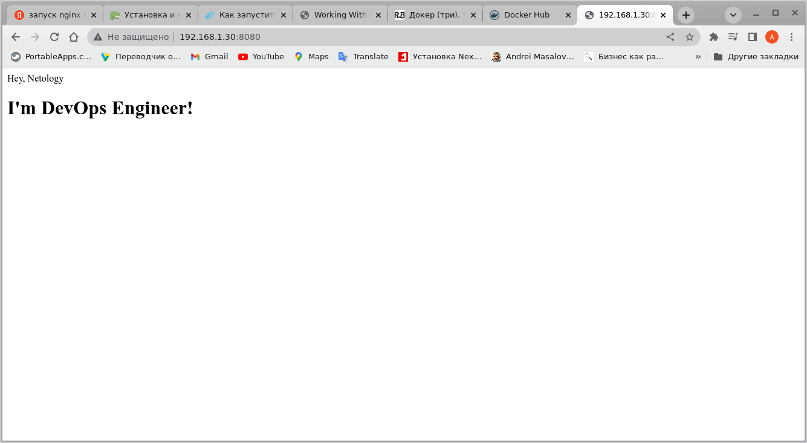

# Домашнее задание к занятию "5.3. Введение. Экосистема. Архитектура. Жизненный цикл Docker контейнера."

---

## Задание 1

Сценарий выполнения задачи:

* Создайте свой репозиторий на https://hub.docker.com;  
* Выберете любой образ, который содержит веб-сервер Nginx;  
* Создайте свой fork образа;  
* Реализуйте функциональность: запуск веб-сервера в фоне с индекс-страницей, содержащей HTML-код ниже:  
````
  <html>
    <head>
    Hey, Netology
    </head>
    <body>
    <h1>I’m DevOps Engineer!</h1>
    </body>
  </html>
````
* Опубликуйте созданный форк в своем репозитории и предоставьте ответ в виде ссылки на https://hub.docker.com/username_repo.  

Решение:
- Готовим файл index.html  
````
vagrant@TestServer1:~$ mkdir -p docker-nginx/
vagrant@TestServer1:~$ cd ./docker-nginx
vagrant@TestServer1:~/docker-nginx$ nano index.html
vagrant@TestServer1:~/docker-nginx$ cat index.html
<html>
    <head>
    Hey, Netology
    </head>
    <body>
    <h1>I’m DevOps Engineer!</h1>
    </body>
  </html>
````
- Готовим файл Dockerfile  
````
vagrant@TestServer1:~/docker-nginx$ nano Dockerfile 
vagrant@TestServer1:~/docker-nginx$ cat Dockerfile 
FROM nginx
COPY index.html /usr/share/nginx/html/
````
- Собираем images   
````
vagrant@TestServer1:~/docker-nginx$ docker pull nginx
vagrant@TestServer1:~/docker-nginx$ docker build -f Dockerfile -t vedernikovaa/devops23:1.5.3 .
Sending build context to Docker daemon  3.072kB
Step 1/2 : FROM nginx
latest: Pulling from library/nginx
8740c948ffd4: Pull complete 
d2c0556a17c5: Pull complete 
c8b9881f2c6a: Pull complete 
693c3ffa8f43: Pull complete 
8316c5e80e6d: Pull complete 
b2fe3577faa4: Pull complete 
Digest: sha256:b8f2383a95879e1ae064940d9a200f67a6c79e710ed82ac42263397367e7cc4e
Status: Downloaded newer image for nginx:latest
 ---> a99a39d070bf
Step 2/2 : COPY index.html /usr/share/nginx/html/
 ---> beb38e4795ed
Successfully built beb38e4795ed
Successfully tagged vedernikovaa/devops23:1.5.3
````
- Выкладываем файл образа на hub.docker.com  
````
vagrant@TestServer1:~/docker-nginx$ docker login
Authenticating with existing credentials...
WARNING! Your password will be stored unencrypted in /home/vagrant/.docker/config.json.
Configure a credential helper to remove this warning. See
https://docs.docker.com/engine/reference/commandline/login/#credentials-store

Login Succeeded
vagrant@TestServer1:~/docker-nginx$ docker push vedernikovaa/devops23:1.5.3
The push refers to repository [docker.io/vedernikovaa/devops23]
68cc789aaf2c: Pushed 
80115eeb30bc: Mounted from library/nginx 
049fd3bdb25d: Mounted from library/nginx 
ff1154af28db: Mounted from library/nginx 
8477a329ab95: Mounted from library/nginx 
7e7121bf193a: Mounted from library/nginx 
67a4178b7d47: Mounted from library/nginx 
1.5.3: digest: sha256:92e77ca2eff29e8b6a571d09a7f0c2e87ab5327170a33c626e7e73d28a2fb236 size: 1777
````
- Запускаем и проверяем собранный образ
````
vagrant@TestServer1:~/docker-nginx$ docker run -d -p 8080:80 vedernikovaa/devops23:1.5.3
69d65d936d41b725400075b0c9685b4b5c40d9a76dd2bf5c18b65ca26c26fb05
````
Скрин загруженной nginx страницы из браузера   


 - [Images from hub.docker.com](https://hub.docker.com/layers/vedernikovaa/devops23/1.5.3/images/sha256-92e77ca2eff29e8b6a571d09a7f0c2e87ab5327170a33c626e7e73d28a2fb236?context=repo)

## Задание 2

Посмотрите на сценарий ниже и ответьте на вопрос: "Подходит ли в этом сценарии использование Docker контейнеров или 
лучше подойдет виртуальная машина, физическая машина? Может быть возможны разные варианты?"  
Детально опишите и обоснуйте свой выбор.  
--  
Сценарий:  

Высоконагруженное монолитное java веб-приложение;  
Nodejs веб-приложение;  
Мобильное приложение c версиями для Android и iOS;  
Шина данных на базе Apache Kafka;  
Elasticsearch кластер для реализации логирования продуктивного веб-приложения - три ноды elasticsearch, два logstash и две ноды kibana;  
Мониторинг-стек на базе Prometheus и Grafana;  
MongoDB, как основное хранилище данных для java-приложения;    
Gitlab сервер для реализации CI/CD процессов и приватный (закрытый) Docker Registry.  

Решение:

- Высоконагруженное монолитное java веб-приложение; 
> Физическая машина, т.к. нет рнакладных расходов ресурсов на виртуализацию. Благодаря монолитности нет необходимости 
> готовить специфическое окружение.

- Nodejs веб-приложение;
> Docker, т.к. проще создавать окружение в рабочих средах.

- Мобильное приложение c версиями для Android и iOS;
> Виртуальные машины, т.к. не уверен, что есть возможность создать разные окружения на одной хостовой машине в Docker.

- Шина данных на базе Apache Kafka;
> Docker, есть готовые образы для apache kafka. Проще откатить при обнаружении багов.

- Elasticsearch кластер для реализации логирования продуктивного веб-приложения - три ноды elasticsearch, два logstash 
и две ноды kibana;
> Docker, Elasticsearch доступен для установки как образ docker. Удобно работать с логами используя кластеризацию,
> меньше времени на запуск контейнеров.

- Мониторинг-стек на базе Prometheus и Grafana;
> Docker. Есть готовые образы, удобно масштабировать и скорость разворачивания.

- MongoDB, как основное хранилище данных для java-приложения;
> Физическая машина либо виртуальный сервер. Меньше программных прослоек, ниже вероятность сбоя.

- Gitlab сервер для реализации CI/CD процессов и приватный (закрытый) Docker Registry
> Могут быть применены все варианты, в зависимости от наличия соответствующих ресурсов.


## Задача 3

* Запустите первый контейнер из образа centos c любым тэгом в фоновом режиме, подключив папку /data из текущей рабочей 
директории на хостовой машине в /data контейнера;  
* Запустите второй контейнер из образа debian в фоновом режиме, подключив папку /data из текущей рабочей директории на 
хостовой машине в /data контейнера;  
* Подключитесь к первому контейнеру с помощью docker exec и создайте текстовый файл любого содержания в /data;  
* Добавьте еще один файл в папку /data на хостовой машине;  
* Подключитесь во второй контейнер и отобразите листинг и содержание файлов в /data контейнера.  

Приложить вывод команд установленных версий каждой из программ, оформленный в markdown.  

Решение:
- Создание папки data  
````
vagrant@TestServer1:~/docker-nginx$ mkdir ./data
vagrant@TestServer1:~/docker-nginx$ dir
data  Dockerfile  index.html
````
- Запуск контейнеров Debian и CentOS  
````
agrant@TestServer1:~/docker-nginx/data$ sudo docker run -v /$PWD:/data --name centos-container -d -t centos
fc27d18adde716323adea28ee1f5e648e47c52745aa52dd461118849f834c68b
vagrant@TestServer1:~/docker-nginx/data$ sudo docker run -v /$PWD:/data --name debian-container -d -t debian
a4baec389f1355193c8ab8d8477edcfc204c1eca2711def49c1100f561e46db6
vagrant@TestServer1:~/docker-nginx/data$ sudo docker ps
CONTAINER ID   IMAGE     COMMAND       CREATED          STATUS          PORTS     NAMES
a4baec389f13   debian    "bash"        11 seconds ago   Up 10 seconds             debian-container
fc27d18adde7   centos    "/bin/bash"   24 seconds ago   Up 23 seconds             centos-container
````
- Создаем файл в контейнере с Debian  
````
vagrant@TestServer1:~/docker-nginx$ sudo docker exec -it debian-container /bin/bash
root@a4baec389f13:/# dir
bin   data  etc   lib	 media	opt   root  sbin  sys  usr
boot  dev   home  lib64  mnt	proc  run   srv   tmp  var
root@a4baec389f13:/# cd data
root@a4baec389f13:/data# echo test. Debian-container>Debian.txt
````
- Создаем файл на host машине    
````
vagrant@TestServer1:~/docker-nginx/data$ nano Host.txt
vagrant@TestServer1:~/docker-nginx/data$ cat host.txt 
test. Host
````
- Подключаемся к контейнеру CentOS и проверяем содержимое папки и файлов в ней  
````
vagrant@TestServer1:~/docker-nginx/data$ sudo docker exec -it centos-container /bin/bash
[root@fc27d18adde7 /]# cd data
[root@fc27d18adde7 data]# dir
Debian.txt  Host.txt
[root@fc27d18adde7 data]# cat Host.txt 
test. Host
[root@fc27d18adde7 data]# cat Debian.txt 
test. Debian-container
````