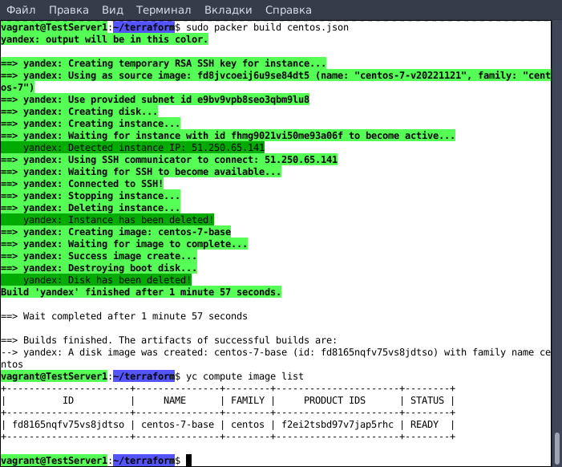
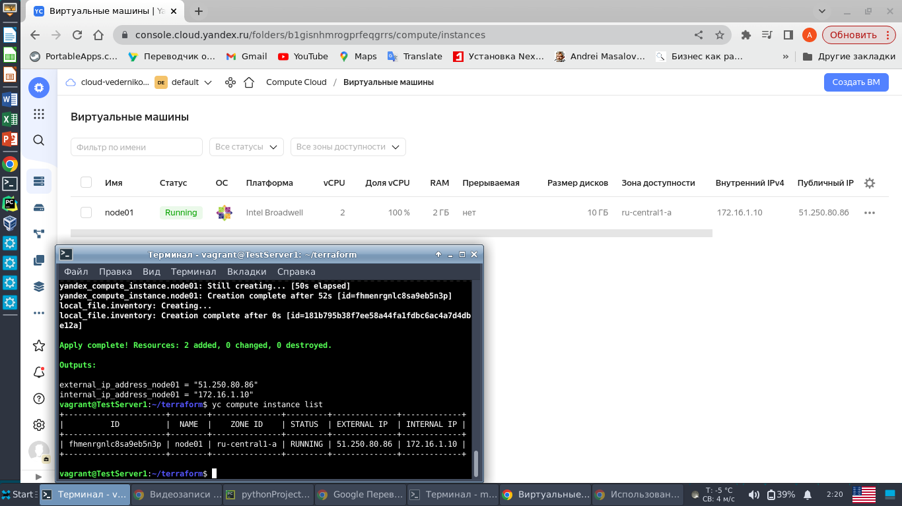
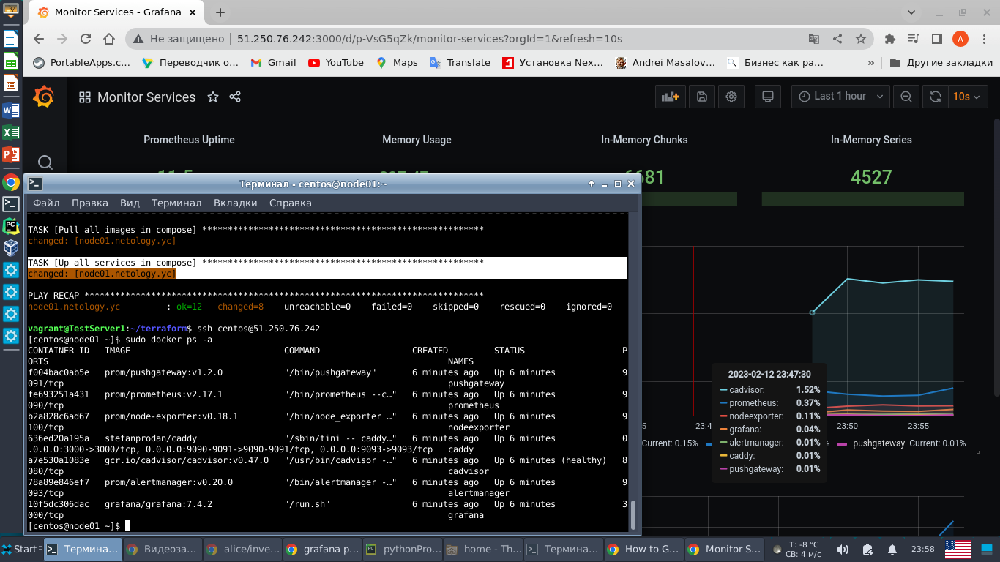
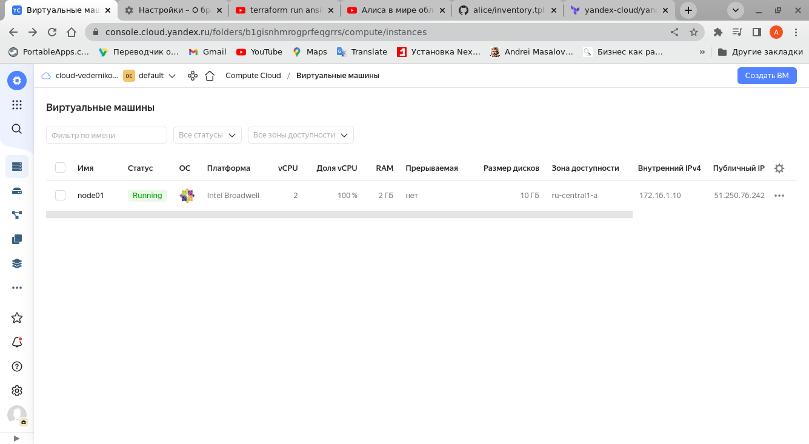

# Домашнее задание к занятию "5.4. Оркестрация группой Docker контейнеров на примере Docker Compose"

---

## Задание 1

Создать собственный образ любой операционной системы (например, centos-7) с помощью Packer (инструкция)
Для получения зачета вам необходимо предоставить скриншот страницы с созданным образом из личного кабинета YandexCloud.

Решение:

Проверяем отсутствие образов. 
````
vagrant@TestServer1:~$ yc compute image list
+----+------+--------+-------------+--------+
| ID | NAME | FAMILY | PRODUCT IDS | STATUS |
+----+------+--------+-------------+--------+
+----+------+--------+-------------+--------+
````
Создаем сеть и подсеть.
````
vagrant@TestServer1:~$ yc vpc network create --name net --labels label=netology --description "Network for netology"
id: enptrdvpojp6acbl0gki
folder_id: b1gisnhmrogprfeqgrrs
created_at: "2023-01-29T14:10:37Z"
name: net
description: Network for netology
labels:
  label: netology

vagrant@TestServer1:~$ yc vpc subnet create --name subnet-a --zone ru-central1-a --range 172.16.1.0/24 --network-name net --description "My subnet"
id: e9bv9vpb8seo3qbm9lu8
folder_id: b1gisnhmrogprfeqgrrs
created_at: "2023-01-29T14:26:20Z"
name: subnet-a
description: My subnet
network_id: enptrdvpojp6acbl0gki
zone_id: ru-central1-a
v4_cidr_blocks:
  - 172.16.1.0/24
````
Создаем образ CentOS 7. 
````
vagrant@TestServer1:~/terraform$ sudo packer build centos.json 
yandex: output will be in this color.

==> yandex: Creating temporary RSA SSH key for instance...
==> yandex: Using as source image: fd8jvcoeij6u9se84dt5 (name: "centos-7-v20221121", family: "centos-7")
==> yandex: Use provided subnet id e9bv9vpb8seo3qbm9lu8
==> yandex: Creating disk...
==> yandex: Creating instance...
==> yandex: Waiting for instance with id fhmg9021vi50me93a06f to become active...
    yandex: Detected instance IP: 51.250.65.141
==> yandex: Using SSH communicator to connect: 51.250.65.141
==> yandex: Waiting for SSH to become available...
==> yandex: Connected to SSH!
==> yandex: Stopping instance...
==> yandex: Deleting instance...
    yandex: Instance has been deleted!
==> yandex: Creating image: centos-7-base
==> yandex: Waiting for image to complete...
==> yandex: Success image create...
==> yandex: Destroying boot disk...
    yandex: Disk has been deleted!
Build 'yandex' finished after 1 minute 57 seconds.

==> Wait completed after 1 minute 57 seconds

==> Builds finished. The artifacts of successful builds are:
--> yandex: A disk image was created: centos-7-base (id: fd8165nqfv75vs8jdtso) with family name centos
````
Проверяем создание образа.
````
vagrant@TestServer1:~/terraform$ yc compute image list
+----------------------+---------------+--------+----------------------+--------+
|          ID          |     NAME      | FAMILY |     PRODUCT IDS      | STATUS |
+----------------------+---------------+--------+----------------------+--------+
| fd8165nqfv75vs8jdtso | centos-7-base | centos | f2ei2tsbd97v7jap5rhc | READY  |
+----------------------+---------------+--------+----------------------+--------+
````



## Задание 2

2.1 Создать вашу первую виртуальную машину в YandexCloud с помощью web-интерфейса YandexCloud.

2.2* (Необязательное задание)
Создать вашу первую виртуальную машину в YandexCloud с помощью terraform (вместо использования веб-интерфейса 
YandexCloud). Используйте terraform код в директории (src/terraform)

Решение:

Для установки приложений HashiCorp Developer пришлось использовать VPS (тунеллирование VPN через протокол SSH).

````
vagrant@TestServer1:~/terraform$ wget -qO- eth0.me
18.196.51.25
````
После этого удалось инсталлировать terraform и yandex cloud.  
Удалось запустить ВМ в yandex cloud.  
Ниже скрин из консоли и результат выполнения "yc compute instance list".  




## Задача 3

С помощью ansible и docker-compose разверните на виртуальной машине из предыдущего задания систему мониторинга на 
основе Prometheus/Grafana. Используйте ansible код в директории (src/ansible).  
Для получения зачета вам необходимо предоставить вывод команды "docker ps", все контейнеры, описанные в 
(docker-compose), должны быть в статусе "Up".  

Решение:

Создана ВМ с помощью Terraform. Во время выполнения операции, создается динамически inventary файл. Он нужен для 
последующего запуска Ansible. Вторым этапом Аnsible устанавливает docker и docker-compose, с последующим развертыванием
приложений для мониторинга. Ниже приведен вывод `docker ps` на ВМ.
````
vagrant@TestServer1:~/terraform$ ssh centos@51.250.76.242
[centos@node01 ~]$ sudo docker ps -a
CONTAINER ID   IMAGE                              COMMAND                  CREATED         STATUS                   PORTS                                                                              NAMES
f004bac0ab5e   prom/pushgateway:v1.2.0            "/bin/pushgateway"       6 minutes ago   Up 6 minutes             9091/tcp                                                                           pushgateway
fe693251a431   prom/prometheus:v2.17.1            "/bin/prometheus --c…"   6 minutes ago   Up 6 minutes             9090/tcp                                                                           prometheus
b2a828c6ad67   prom/node-exporter:v0.18.1         "/bin/node_exporter …"   6 minutes ago   Up 6 minutes             9100/tcp                                                                           nodeexporter
636ed20a195a   stefanprodan/caddy                 "/sbin/tini -- caddy…"   6 minutes ago   Up 6 minutes             0.0.0.0:3000->3000/tcp, 0.0.0.0:9090-9091->9090-9091/tcp, 0.0.0.0:9093->9093/tcp   caddy
a7e530a1083e   gcr.io/cadvisor/cadvisor:v0.47.0   "/usr/bin/cadvisor -…"   6 minutes ago   Up 6 minutes (healthy)   8080/tcp                                                                           cadvisor
78a89e846ef7   prom/alertmanager:v0.20.0          "/bin/alertmanager -…"   6 minutes ago   Up 6 minutes             9093/tcp                                                                           alertmanager
10f5dc306dac   grafana/grafana:7.4.2              "/run.sh"                6 minutes ago   Up 6 minutes             3000/tcp                                                                           grafana
[centos@node01 ~]$ 
````
Ниже скрины запущенного мониторинга и работающей ВМ. 


