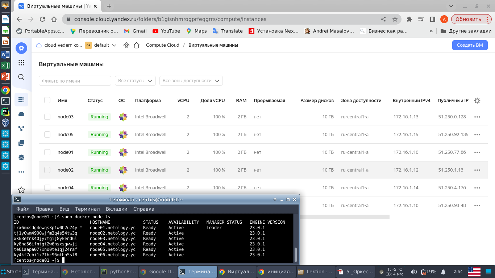

# Домашнее задание к занятию 5.5 "Оркестрация кластером Docker контейнеров на примере Docker Swarm"

---

## Задание 1

Дайте письменные ответы на следующие вопросы:  
 - В чём отличие режимов работы сервисов в Docker Swarm кластере: replication и global?  
 - Какой алгоритм выбора лидера используется в Docker Swarm кластере?  
 - Что такое Overlay Network?  

Решение:
 - Для replication мы явно указываем количество реплик сервиса, которые хотим запустить. В режиме global запускается 
одна реплика на каждом узле, заранее заданного количества реплик нет. 

 - Лидер выбирается командой: docker swarm init  
   Механизм выбора лидера основан на алгоритме raft, который включает в себя 3 принципа выбора лидера:  
     1) Кандидат получает большинство голосов (включая свой) и побеждает в выборах.  
     2) Кандидат получает сообщение от уже действующего лидера текущего срока или от любого сервера более старшего срока.  
     3) Кандидат не получает за некоторый таймаут большинство голосов.
 
 - Overlay network - это внутренняя виртуальная сеть кластера docker swarm, которая упрощает взаимодействие узлов 
кластера между собой.

## Задание 2

Создать ваш первый Docker Swarm кластер в Яндекс.Облаке  
Для получения зачета, вам необходимо предоставить скриншот из терминала (консоли), с выводом команды:  

> docker node ls  

Решение:

В облаке запущены 6 ВМ. На одной произведена инициализация swarm. Остальные подключены к ней.
Ниже скрин из консоли и результат выполнения "docker node ls"




## Задача 3

Создать ваш первый, готовый к боевой эксплуатации кластер мониторинга, состоящий из стека микросервисов.  
Для получения зачета, вам необходимо предоставить скриншот из терминала (консоли), с выводом команды:
> docker service ls  


Решение:

На базе решения предыдущего задания создан кластер. Вывод ниже.
````
[centos@node01 ~]$ sudo docker node ls
ID                            HOSTNAME             STATUS    AVAILABILITY   MANAGER STATUS   ENGINE VERSION
y8946h3kvilkp3jyh1ppncqim *   node01.netology.yc   Ready     Active         Leader           23.0.1
tjmbitljk2ng34g8yh4minvnm     node02.netology.yc   Ready     Active         Reachable        23.0.1
xolzr65awbb2ucyrnyz1jbz4x     node03.netology.yc   Ready     Active         Reachable        23.0.1
sx726513i2z010v4kxteureoa     node04.netology.yc   Ready     Active                          23.0.1
omc5gweekj9jui2oxueflgz4h     node05.netology.yc   Ready     Active                          23.0.1
r6dmn4ee9tmqpsz5c0v3lkfug     node06.netology.yc   Ready     Active                          23.0.1

````
На кластере развернут сервис. Вывод команды из консоли ниже.
````
[centos@node01 ~]$ sudo docker service ls
ID             NAME                                MODE         REPLICAS   IMAGE                                          PORTS
n7do6wz5az3s   swarm_monitoring_alertmanager       replicated   1/1        stefanprodan/swarmprom-alertmanager:v0.14.0    
j3vcnzbrxwoc   swarm_monitoring_caddy              replicated   1/1        stefanprodan/caddy:latest                      *:3000->3000/tcp, *:9090->9090/tcp, *:9093-9094->9093-9094/tcp
yx0ck5hn3zx5   swarm_monitoring_cadvisor           global       6/6        google/cadvisor:latest                         
bqqxzsh9rnnt   swarm_monitoring_dockerd-exporter   global       6/6        stefanprodan/caddy:latest                      
m4q4kmfszqgu   swarm_monitoring_grafana            replicated   1/1        stefanprodan/swarmprom-grafana:5.3.4           
rdhyo6zps2qe   swarm_monitoring_node-exporter      global       6/6        stefanprodan/swarmprom-node-exporter:v0.16.0   
ncsgubsz49dk   swarm_monitoring_prometheus         replicated   1/1        stefanprodan/swarmprom-prometheus:v2.5.0       
uljqtk2k912s   swarm_monitoring_unsee              replicated   1/1        cloudflare/unsee:v0.8.0                        
````
Скрин работающего сервиса 

