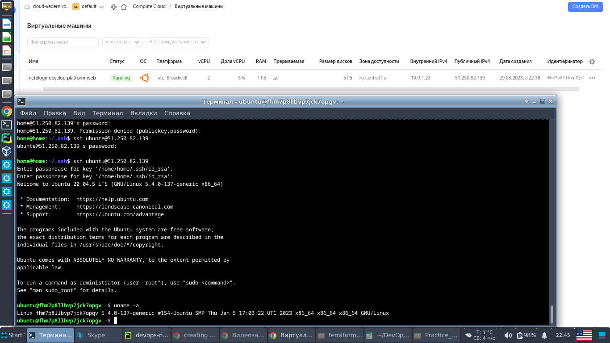
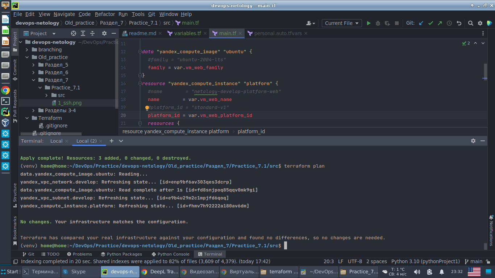
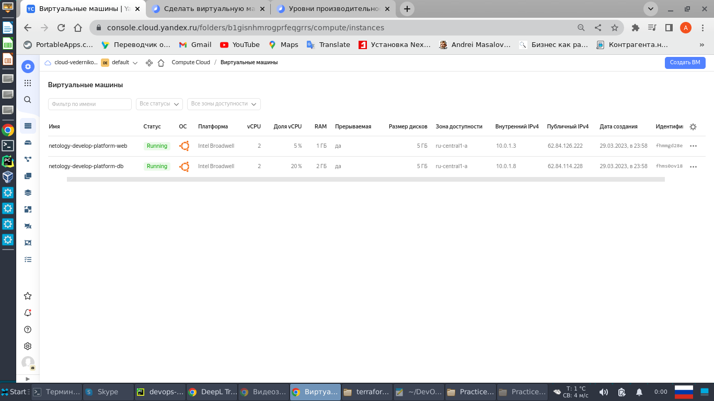
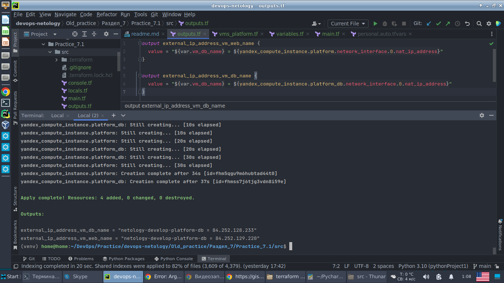
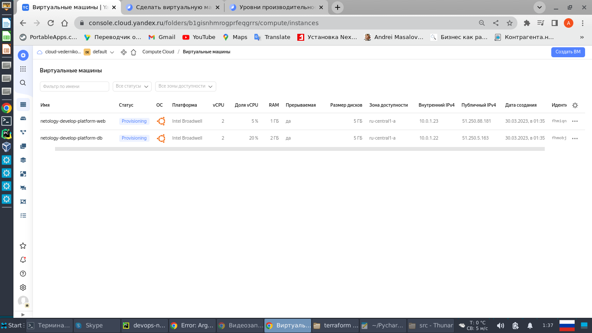
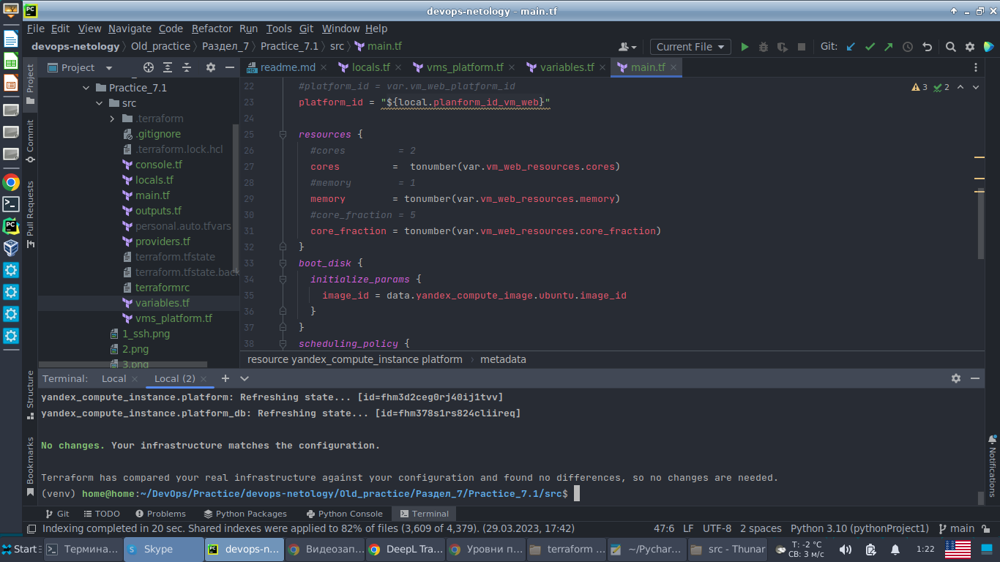

# Домашнее задание к занятию 7.2 "Основы Terraform. Yandex Cloud"

---

## Задание 1

1) Изучите проект. В файле variables.tf объявлены переменные для yandex provider.  
2) Переименуйте файл personal.auto.tfvars_example в personal.auto.tfvars. Заполните переменные (идентификаторы облака, 
токен доступа). Благодаря .gitignore этот файл не попадет в публичный репозиторий. Вы можете выбрать иной способ 
безопасно передать секретные данные в terraform.  
3) Сгенерируйте или используйте свой текущий ssh ключ. Запишите его открытую часть в переменную vms_ssh_root_key.  
4) Инициализируйте проект, выполните код. Исправьте возникшую ошибку. Ответьте в чем заключается ее суть?  
5) Ответьте, как в процессе обучения могут пригодиться параметры preemptible = true и core_fraction=5 в параметрах ВМ?   
Ответ в документации Yandex cloud.    
В качестве решения приложите:  
- скриншот ЛК Yandex Cloud с созданной ВМ,  
- скриншот успешного подключения к консоли ВМ через ssh,  
- ответы на вопросы.  

Решение:

5) Параметр core_fraction определяет относительную долю ресурсов ЦП, которые может использовать ВМ, 
Параметр preemptible = true, включает режим вытесняемой ВМ. Это недорогие экземпляры, которые могут быть прерваны 
в любой момент, но при эффективном использовании могут обеспечить значительную экономию средств.
Для нашей платформы применимы следующие параметры:
````
Платформа Intel Broadwell (standard-v1):
-----------------------------------------------------------
| Уровень              |                | RAM на 1 ядро,  |
| производительности   |     vCPU       | ГБ              |
| ---------------------------------------------------------
| 5%	               | 2, 4	        | 0.5, 1, 1.5, 2  |
|                      |                |                 |
| 20%	               | 2, 4	        | 0.5, 1, 1.5, 2, |
|                      |                | 2.5, 3, 3.5, 4  |
|                      |                |                 |
| 100%	               |2, 4, 6, 8,     | 1, 2, 3, 4,     |
|                      |10, 12, 14, 16, | 5, 6, 7, 8      |
|                      |20, 24, 28, 32  |                 |
-----------------------------------------------------------
````    
Скриншот запущенной ВМ и подключения к ней через ssh.



## Задание 2

1) Изучите файлы проекта.  
2) Замените все "хардкод" значения для ресурсов yandex_compute_image и yandex_compute_instance на отдельные 
переменные. К названиям переменных ВМ добавьте в начало префикс vm_web_ . Пример: vm_web_name.  
3) Объявите нужные переменные в файле variables.tf, обязательно указывайте тип переменной. Заполните их default 
прежними значениями из main.tf.  
4) Проверьте terraform plan (изменений быть не должно).  


Решение:

В файле variables.tf прописаны переменные ВМ. Определены их значения по дефолту и краткое описание.
````
variable "vm_web_family" {
  type        = string
  default     = "ubuntu-2004-lts"
  description = "Distribution name"
}
variable "vm_web_name" {
  type        = string
  default     = "netology-develop-platform-web"
  description = "Name VM"
}
variable "vm_web_platform_id" {
  type        = string
  default     = "standard-v1"
  description = "The name of the platform that determines the configuration of computing resources"
}
````    
"Новые" переменные определены в main.tf. Запуск команды "terraform plan" не примела изменению конфигурации 
запущенной ВМ.
Скриншот выполнения команды "terraform plan".


## Задание 3

1) Создайте в корне проекта файл 'vms_platform.tf'. Перенесите в него все переменные ВМ.  
2) Скопируйте блок ресурса и создайте с его помощью вторую ВМ: "netology-develop-platform-db" , cores = 2, 
memory = 2, core_fraction = 20. Объявите ее переменные с префиксом vm_db_ в том же файле.  
3) Примените изменения.   

Решение:

<details><summary>Конфигурация ВМ vm_db. Тест файла vms_platform.tf</summary>

````
   ###vm_db vars

variable "vm_db_family" {
  type        = string
  default     = "ubuntu-2004-lts"
  description = "Distribution name"
}
variable "vm_db_name" {
  type        = string
  default     = "netology-develop-platform-db"
  description = "Name VM"
}
variable "vm_db_platform_id" {
  type        = string
  default     = "standard-v1"
  description = "The name of the platform that determines the configuration of computing resources"
}
data "yandex_compute_image" "ubuntu_db" {
  #family = "ubuntu-2004-lts"
  family = var.vm_db_family
}

resource "yandex_compute_instance" "platform_db" {
  #name        = "netology-develop-platform-web"
  name        = var.vm_db_name
  #platform_id = "standard-v1"
  platform_id = var.vm_db_platform_id
  resources {
    cores         = 2
    memory        = 2
    core_fraction = 20
  }
  boot_disk {
    initialize_params {
      image_id = data.yandex_compute_image.ubuntu_db.image_id
    }
  }
  scheduling_policy {
    preemptible = true
  }
  network_interface {
    subnet_id = yandex_vpc_subnet.develop.id
    nat       = true
  }

  metadata = {
    serial-port-enable = 1
    ssh-keys           = "home:${var.vms_ssh_root_key}"
  }
}
````
</details>

Скриншот запущенной конфигураций 2-х ВМ (vm_web и vm_db)



## Задание 4

1) Объявите в файле outputs.tf отдельные output, для каждой из ВМ с ее внешним IP адресом.  
2) Примените изменения.  
В качестве решения приложите вывод значений ip-адресов команды terraform output.  

Решение:

<details><summary>Содержание файла outputs.tf</summary>

````
output external_ip_address_vm_web_name {
  value = "${var.vm_db_name} = ${yandex_compute_instance.platform.network_interface.0.nat_ip_address}"
}

output external_ip_address_vm_db_name {
  value = "${var.vm_db_name} = ${yandex_compute_instance.platform_db.network_interface.0.nat_ip_address}"
}
````
</details>

Скриншот вывода внешних адресов для каждой ВМ

 


## Задание 5

- В файле locals.tf опишите в одном local-блоке имя каждой ВМ, используйте интерполяцию ${..} с несколькими переменными 
по примеру из лекции.  
- Замените переменные с именами ВМ из файла variables.tf на созданные вами local переменные.  
Примените изменения.   

Решение:

Содержание файла locals.tf с описанием блока local.
````
locals {
  family_vm_db = "ubuntu-2004-lts"
  name_vm_db = "netology-develop-platform-db"
  planform_id_vm_db = "standard-v1"
  family_vm_web = "ubuntu-2004-lts"
  name_vm_web = "netology-develop-platform-web"
  planform_id_vm_web= "standard-v1"
}
````    
Применение переменных в описании ВМ "vm_db"
````
data "yandex_compute_image" "ubuntu_db" {
  family = "${local.family_vm_db}"
}

resource "yandex_compute_instance" "platform_db" {
  name         = "${local.name_vm_db}"
  platform_id = "${local.planform_id_vm_db}"
````

Применение переменных в описании ВМ "vm_web"
````
data "yandex_compute_image" "ubuntu_db" {
  family = "${local.family_vm_web}"
}

resource "yandex_compute_instance" "platform_db" {
  name         = "${local.name_vm_web}"
  platform_id = "${local.planform_id_vm_web}"
````

Скриншот запущенных ВМ.




## Задание 6

- Вместо использования 3-х переменных ".._cores",".._memory",".._core_fraction" в блоке resources {...}, объедените 
их в переменные типа map с именами "vm_web_resources" и "vm_db_resources".    
- Так же поступите с блоком metadata {serial-port-enable, ssh-keys}, эта переменная должна быть общая для всех 
ваших ВМ.    
- Найдите и удалите все более не используемые переменные проекта.  
- Проверьте terraform plan (изменений быть не должно).  

Решение:

<details><summary>Содержание файла variables.tf с вынесенными в него блоков ресурсов по описанию ВМ.</summary>

````
###resource vars

variable "vm_web_resources" {
  type = map
  default = {
    cores         = 2
    memory        = 1
    core_fraction = 5
  }
}

variable "vm_db_resources" {
  type = map
  default = {
    cores         = 2
    memory        = 2
    core_fraction = 20
  }
}

variable "vm_metadate_resources" {
  type = map
  default = {
    serial-port-enable = 1
    ssh-keys           = "home:$${vms_ssh_root_key}"
  }
}
````    
</details>

Скриншот применения данного блока.

