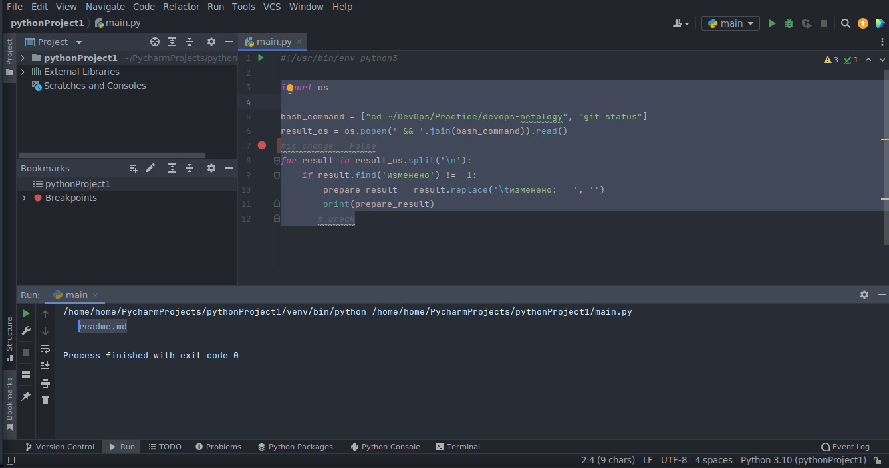
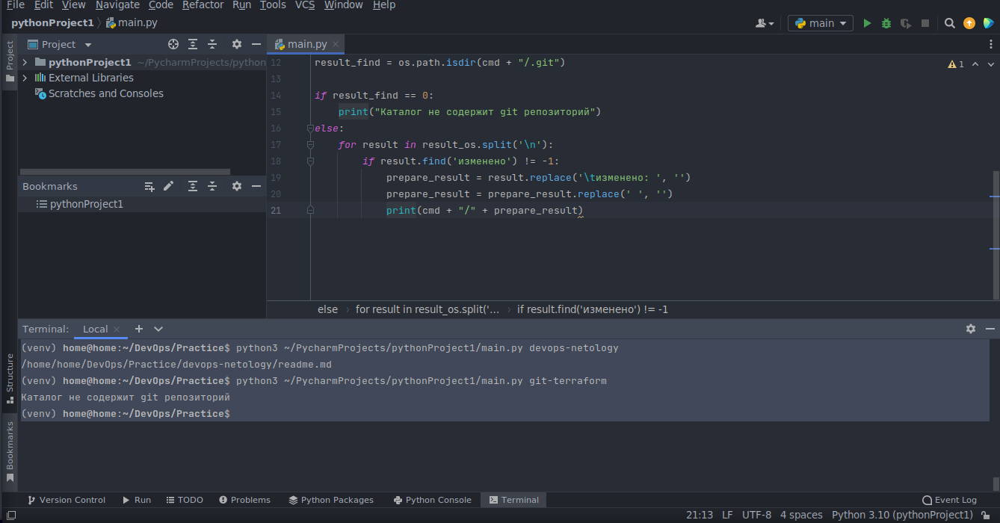
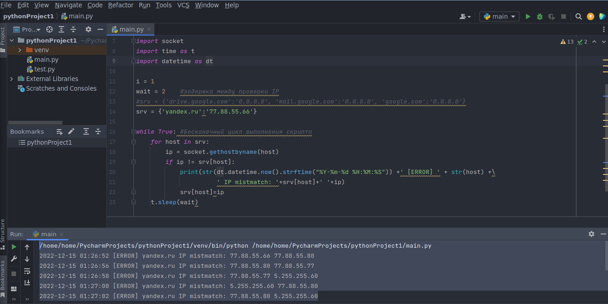
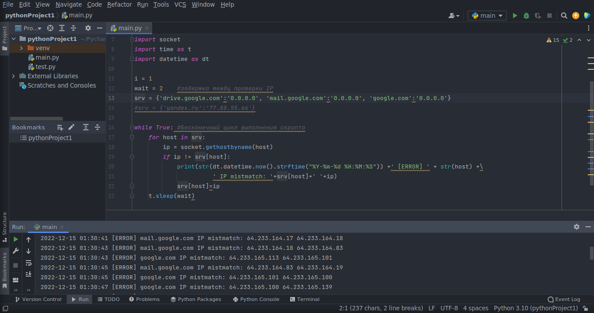

# Домашнее задание к занятию "4.2. Использование Python для решения типовых DevOps задач"

## Задание 1

Есть скрипт:
```python
#!/usr/bin/env python3
a = 1
b = '2'
c = a + b
```

### Вопросы:

| Вопрос  | Ответ |
| ------------- | ------------- |
| Какое значение будет присвоено переменной `c`?  | Ошибка, т.к. пытаемся провести операцию суммирования 2-х переменных разных типов. <br/>a = int, b = str.  |
| Как получить для переменной `c` значение 12?  | Привести типы данных к str при задании значения. <br/>a= '1', <br/>b = '2', <br/>c = a + b <br/>Либо с = str(a) +b  |
| Как получить для переменной `c` значение 3?  | Привести типы данных к int при задании значения. <br/>a = 1, <br/>b = 2, <br/>c = a + b <br/>Либо c = a + int(b)  |

------

## Задание 2

Мы устроились на работу в компанию, где раньше уже был DevOps Engineer. Он написал скрипт, позволяющий узнать, какие файлы модифицированы в репозитории, относительно локальных изменений. Этим скриптом недовольно начальство, потому что в его выводе есть не все изменённые файлы, а также непонятен полный путь к директории, где они находятся. 

Как можно доработать скрипт ниже, чтобы он исполнял требования вашего руководителя?

```python
#!/usr/bin/env python3

import os

bash_command = ["cd ~/netology/sysadm-homeworks", "git status"]
result_os = os.popen(' && '.join(bash_command)).read()
is_change = False
for result in result_os.split('\n'):
    if result.find('modified') != -1:
        prepare_result = result.replace('\tmodified:   ', '')
        print(prepare_result)
        break
```

### Ваш скрипт:
```python
#!/usr/bin/env python3 
import os

bash_command = ["cd ~/DevOps/Practice/devops-netology", "git status"]
result_os = os.popen(' && '.join(bash_command)).read()
#is_change = False
for result in result_os.split('\n'):
    if result.find('изменено') != -1:
        prepare_result = result.replace('\tизменено:   ', '')
        print(prepare_result)
       # break
```

### Вывод скрипта при запуске при тестировании:


------

## Задание 3

Доработать скрипт выше так, чтобы он не только мог проверять локальный репозиторий в текущей директории, но и умел воспринимать путь к репозиторию, который мы передаём как входной параметр. Мы точно знаем, что начальство коварное и будет проверять работу этого скрипта в директориях, которые не являются локальными репозиториями.

### Ваш скрипт:
```python
#!/usr/bin/env python3
import os
import sys

cmd = os.getcwd()
if len(sys.argv) >= 2:
    cmd = cmd + "/" + sys.argv[1]

bash_command = ["cd "+cmd, "git status 2>&1"]
result_os = os.popen(' && '.join(bash_command)).read()
result_find = os.path.isdir(cmd + "/.git")

if result_find == 0:
    print("Каталог не содержит git репозиторий")
else:
    for result in result_os.split('\n'):
        if result.find('изменено') != -1:
            prepare_result = result.replace('\tизменено: ', '')
            prepare_result = prepare_result.replace(' ', '')
            print(cmd + "/" + prepare_result)
```

### Вывод скрипта при запуске при тестировании:


------

## Задание 4

Наша команда разрабатывает несколько веб-сервисов, доступных по http. Мы точно знаем, что на их стенде нет никакой балансировки, кластеризации, за DNS прячется конкретный IP сервера, где установлен сервис. 

Проблема в том, что отдел, занимающийся нашей инфраструктурой очень часто меняет нам сервера, поэтому IP меняются примерно раз в неделю, при этом сервисы сохраняют за собой DNS имена. Это бы совсем никого не беспокоило, если бы несколько раз сервера не уезжали в такой сегмент сети нашей компании, который недоступен для разработчиков. 

Мы хотим написать скрипт, который: 
- опрашивает веб-сервисы, 
- получает их IP, 
- выводит информацию в стандартный вывод в виде: <URL сервиса> - <его IP>. 

Также, должна быть реализована возможность проверки текущего IP сервиса c его IP из предыдущей проверки. Если проверка будет провалена - оповестить об этом в стандартный вывод сообщением: [ERROR] <URL сервиса> IP mismatch: <старый IP> <Новый IP>. Будем считать, что наша разработка реализовала сервисы: `drive.google.com`, `mail.google.com`, `google.com`.

### Ваш скрипт:
```python
#!/usr/bin/env python3

#import socket
#srv = socket.gethostbyname_ex('yandex.ru')
#print(srv)

import socket
import time as t
import datetime as dt

i = 1
wait = 2    #задержка между проверки IP
srv = {'drive.google.com':'0.0.0.0', 'mail.google.com':'0.0.0.0', 'google.com':'0.0.0.0'}
#srv = {'yandex.ru':'77.88.55.66'}

while True: #Бесконечный цикл выполнения скрипта
    for host in srv:
        ip = socket.gethostbyname(host)
        if ip != srv[host]:
            print(str(dt.datetime.now().strftime("%Y-%m-%d %H:%M:%S")) +' [ERROR] ' + str(host) +\
                      ' IP mistmatch: '+srv[host]+' '+ip)
            srv[host]=ip
    t.sleep(wait)
```

### Вывод скрипта при запуске при тестировании:
Тестирование сервера yandex.ru



Тестирование серверов google.com


