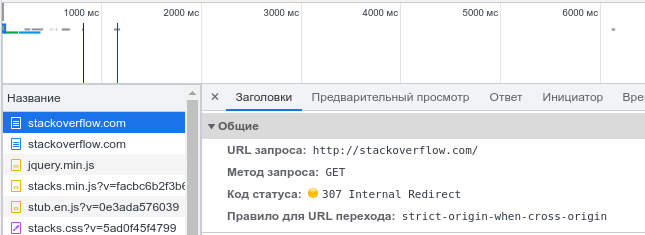
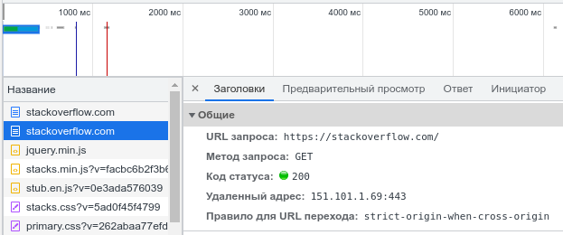
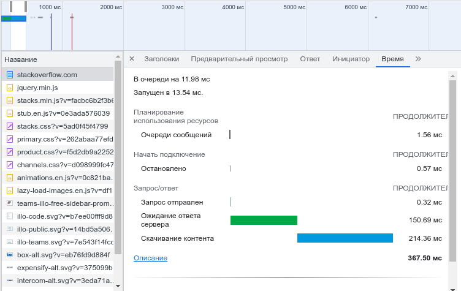
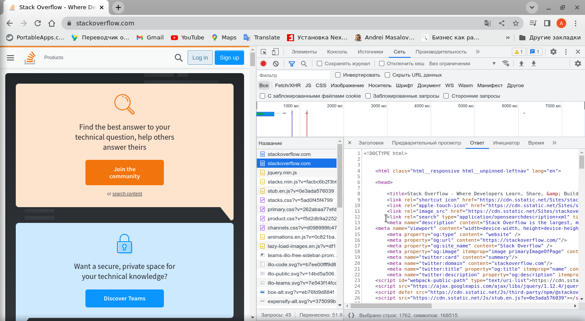

# DevOps-netology-23
## Vedernikov Alexandr
## Домашнее задание к занятию "3.6. Компьютерные сети. Лекция 1"

**1. Работа c HTTP через телнет.**  
    • Подключитесь утилитой телнет к сайту stackoverflow.com  
>        telnet stackoverflow.com 80  

• Отправьте HTTP запрос  

>        GET /questions HTTP/1.0  
>        HOST: stackoverflow.com  
>        [press enter]  
>        [press enter]  
**В ответе укажите полученный HTTP код, что он означает?**  

Решение:  

>home@home:~$ telnet stackoverflow.com 80  
Trying 151.101.65.69...  
Connected to stackoverflow.com.  
Escape character is '^]'.  
GET /questions HTTP/1.0  
HOST: stackoverflow.com
HTTP/1.1 403 Forbidden  
Connection: close  
Content-Length: 1918  
Server: Varnish  
Retry-After: 0  
Content-Type: text/html  
Accept-Ranges: bytes  
Date: Sun, 13 Nov 2022 13:46:25 GMT  
Via: 1.1 varnish  
X-Served-By: cache-hel1410032-HEL  
X-Cache: MISS  
X-Cache-Hits: 0  
X-Timer: S1668347186.750305,VS0,VE1  
X-DNS-Prefetch-Control: off  

        <!DOCTYPE html>
        <html>
        <head>
            <meta http-equiv="Content-Type" content="text/html; charset=UTF-8" />
            <title>Forbidden - Stack Exchange</title>
            
        </head>
        <body>
            

        		

        			
        		

        		

        			<h1>Access Denied</h1>
                                
This IP address (178.75.61.101) has been blocked from access to our services. If you 
                                believe this to be in error, please contact us at <a href="mailto:team@stackexchange.com?
                                Subject=Blocked%20178.75.61.101%20(Request%20ID%3A%20640495643-HEL)">team@stackexchange.com</a>.

                                
When contacting us, please include the following information in the email:

                                
Method: block

                                
XID: 640495643-HEL

                                
IP: 178.75.61.101

                                
X-Forwarded-For: 

                                
User-Agent: 

                                
Time: Sun, 13 Nov 2022 13:46:25 GMT

                                
URL: stackoverflow.com/questions

                                
Browser Location: (not loaded)

        		

        	

        	
        </body>
        </html>Connection closed by foreign host.

Код ответа на статус ошибки "HTTP 403 Forbidden" указывает, что сервер понял запрос, но отказывается его авторизовать. 
Означает ограничение или отсутствие доступа к материалу на странице, которую вы пытаетесь загрузить. 
178.75.61.101 ip адрес, выданный мне в текущей сессии провайдером, занесен в список заблокированных адресов. 

        <h1>Access Denied</h1>
                  
This IP address (178.75.61.101) has been blocked from access to our services. If you believe 
                  this to be in error, please contact us at <a href="mailto:team@stackexchange.com?
                  Subject=Blocked%20178.75.61.101%20(Request%20ID%3A%20640495643-HEL)">team@stackexchange.com</a>.

Для решения вопроса доступа предлагается обратиться по электронной почте team@stackexchange.com

**2. Повторите задание 1 в браузере, используя консоль разработчика F12.**  
**• откройте вкладку Network**  
**• отправьте запрос http://stackoverflow.com**  
**• найдите первый ответ HTTP сервера, откройте вкладку Headers**  
**• укажите в ответе полученный HTTP код**  
**• проверьте время загрузки страницы, какой запрос обрабатывался дольше всего?**  
**• приложите скриншот консоли браузера в ответ.**  

Решение:  
Мы направляем запрос к серверу по протоколу http. Ответом сервер нас перенаправляет наше 
общение по протоколу https и направлять запросы на 443 порт.

После перехода на защищенный протокол получается ответ от сервера. Он же и является самым 
длительным запросом.   
Обработка запроса ~ 150 мс  
Скачивание контента ~ 214 мс  

Скриншот консоли браузера:

**3. Какой IP адрес у вас в интернете?**  

Решение:  
Простая команда ip add не сдаст  правильного ответа, т.к. я нахожусь за NAT-ом роутера. 
Поэтому надо подключиться к router-у и посмотреть какие ip адреса у него на сетевых портах.

        home@home:~$ ssh 192.168.1.1  
        BusyBox v1.31.1 (2022-04-19 12:26:54 +05) built-in shell (ash)  
        Enter 'help' for a list of built-in commands.  
        /home/root # ip add | grep "inet"  
            inet 127.0.0.1/8 brd 127.255.255.255 scope host lo  
            inet 192.168.1.1/24 brd 192.168.1.255 scope global br0  
            inet 178.75.61.101 peer 178.75.11.254/32 brd 178.75.61.101 scope global ppp0  
            inet 10.8.0.1/24 scope global tun1  

Интерфейс br0 и принадлежащий сети ip 192.168.1.1/24 «смотрит» в локальную сеть.  
Интерфейс ppp0 (ip 178.75.61.101) подключен по протоколу PPPoE к IPS. Он и есть адресов 
выхода в интернет.  

Второй способ:

        home@home:~$ curl https://ipinfo.io/ip
        178.75.61.101   

**4. Какому провайдеру принадлежит ваш IP адрес? Какой автономной системе AS? Воспользуйтесь 
утилитой whois**  

Решение:

        home@home:~$ whois 178.75.61.101 | grep -e AS -e descr  
        descr:          JSC "ER-Telecom Holding" Bryansk branch  
        descr:          Bryansk, Russia  
        descr:          PPPoE individual customers  
        status:         ASSIGNED PA  
        descr:          TM DOM.RU, Bryansk ISP  
        % Information related to '178.75.60.0/22AS57044'  
        origin:         AS57044  
        descr:          JSC "ER-Telecom Holding" Bryansk branch  
        descr:          Bryansk, Russia  
        descr:          TM DOM.RU, Bryansk ISP  

Провайдер: JSC "ER-Telecom Holding" Bryansk branch (торговая марка Dom.ru).  
Автономная система: AS57044  

**5. Через какие сети проходит пакет, отправленный с вашего компьютера на адрес 8.8.8.8? Через какие AS? Воспользуйтесь 
утилитой traceroute.**  

Решение:

        home@home:~$ traceroute 8.8.8.8 -A
        traceroute to 8.8.8.8 (8.8.8.8), 30 hops max, 60 byte packets  
         1  192.168.1.1 (192.168.1.1) [*]  0.826 ms  0.869 ms  0.965 ms  
         2  * * *
         3  lag-3-438.bgw01.bryansk.ertelecom.ru (109.194.8.30) [AS57044]  3.141 ms  3.118 ms  3.091 ms  
         4  72.14.215.165 (72.14.215.165) [AS15169]  13.754 ms  17.494 ms  14.685 ms  
         5  72.14.215.166 (72.14.215.166) [AS15169]  12.390 ms  12.984 ms  12.965 ms  
         6  * * *
         7  108.170.250.33 (108.170.250.33) [AS15169]  12.954 ms  12.919 ms 108.170.225.44 (108.170.225.44) [AS15169] 11.549 ms  
         8  108.170.250.130 (108.170.250.130) [AS15169]  15.025 ms 108.170.250.66 (108.170.250.66) [AS15169]  12.820 ms 
         108.170.250.99 (108.170.250.99) [AS15169]  15.867 ms  
         9  142.251.237.154 (142.251.237.154) [AS15169]  29.004 ms 142.251.49.24 (142.251.49.24) [AS15169]  36.080 ms 
         142.251.238.82 (142.251.238.82) [AS15169]  39.792 ms  
        10  142.251.237.148 (142.251.237.148) [AS15169]  30.092 ms 216.239.43.20 (216.239.43.20) [AS15169]  28.574 ms 
        142.251.237.144 (142.251.237.144) [AS15169]  41.587 ms  
        11  172.253.51.185 (172.253.51.185) [AS15169]  27.166 ms 142.250.56.221 (142.250.56.221) [AS15169]  30.874 ms 
        216.239.49.113 (216.239.49.113) [AS15169]  35.915 ms  
        12  * * *
        13  * * *
        14  * * *
        15  * * *
        16  * * *
        17  * * *
        18  * * *
        19  * * *
        20  dns.google (8.8.8.8) [AS15169]  26.371 ms * *  

        home@home:~$ whois -h whois.cymru.com -- '-v AS15169'  
        AS      | CC | Registry | Allocated  | AS Name  
        15169   | US | arin     | 2000-03-30 | GOOGLE, US  

Т.е. получается маршрут пролегает через 2 AS (IPS и Google).  
Действительно  межконтинентальные сети и магистральные сети принадлежат Google? Или часть маршрута при инкапсуляции в 
другие протоколы «теряется»?  

**6. Повторите задание 5 в утилите mtr. На каком участке наибольшая задержка — delay?**  

Решение:

        home@home:~$ mtr -r 8.8.8.8
        Start: 2022-11-13T21:10:07+0300
        HOST: home                        Loss%   Snt   Last   Avg  Best  Wrst StDev
          1.|-- 192.168.1.1                0.0%    10    0.7   0.8   0.7   1.2   0.2
          2.|-- 37x113x195x253.dynamic.br  0.0%    10    1.1   1.3   1.0   1.8   0.3
          3.|-- lag-3-438.bgw01.bryansk.e  0.0%    10    1.8   1.6   1.3   1.8   0.2
          4.|-- 72.14.215.165              0.0%    10   15.7  13.1  11.2  15.7   1.9
          5.|-- 72.14.215.166              0.0%    10    9.8  10.7   9.4  17.0   2.3
          6.|-- 108.170.250.129            0.0%    10   10.3  12.9   9.8  34.9   7.8
          7.|-- 108.170.250.130            0.0%    10   12.1  12.7  12.0  17.0   1.5
          8.|-- 142.250.238.214            0.0%    10   33.9  34.0  33.8  34.3   0.2
          9.|-- 142.250.235.74             0.0%    10   28.9  28.8  28.2  30.7   0.7
         10.|-- 216.239.42.23              0.0%    10   29.9  30.3  29.6  32.3   0.8
         11.|-- ???                       100.0    10    0.0   0.0   0.0   0.0   0.0
         12.|-- ???                       100.0    10    0.0   0.0   0.0   0.0   0.0
         13.|-- ???                       100.0    10    0.0   0.0   0.0   0.0   0.0
         14.|-- ???                       100.0    10    0.0   0.0   0.0   0.0   0.0
         15.|-- ???                       100.0    10    0.0   0.0   0.0   0.0   0.0
         16.|-- ???                       100.0    10    0.0   0.0   0.0   0.0   0.0
         17.|-- ???                       100.0    10    0.0   0.0   0.0   0.0   0.0
         18.|-- ???                       100.0    10    0.0   0.0   0.0   0.0   0.0
         19.|-- ???                       100.0    10    0.0   0.0   0.0   0.0   0.0
         20.|-- dns.google                 0.0%    10   25.3  25.5  25.2  26.4   0.3

- Avg - среднее время задержки;  
- Best - наименьшее время задержки;  
- Wrst - наибольшее время задержки;  
На прыжке 8 самые большие задержки  

**7. Какие DNS сервера отвечают за доменное имя dns.google? Какие A записи? Воспользуйтесь утилитой dig**

Решение:

        home@home:~$ dig dns.google.com A all
        
        ; <<>> DiG 9.18.8-1-Debian <<>> dns.google.com A all
        ;; global options: +cmd
        ;; Got answer:
        ;; ->>HEADER<<- opcode: QUERY, status: NOERROR, id: 51675
        ;; flags: qr rd ra; QUERY: 1, ANSWER: 2, AUTHORITY: 0, ADDITIONAL: 1
        
        ;; OPT PSEUDOSECTION:
        ; EDNS: version: 0, flags:; udp: 4096
        ;; QUESTION SECTION:
        ;dns.google.com.			IN	A
        
        ;; ANSWER SECTION:
        dns.google.com.		753	IN	A	8.8.4.4
        dns.google.com.		753	IN	A	8.8.8.8
        
        ;; Query time: 0 msec
        ;; SERVER: 109.194.1.4#53(109.194.1.4) (UDP)
        ;; WHEN: Sun Nov 13 21:20:55 MSK 2022
        ;; MSG SIZE  rcvd: 75
        
        ;; Got answer:
        ;; ->>HEADER<<- opcode: QUERY, status: NXDOMAIN, id: 32087
        ;; flags: qr rd ra; QUERY: 1, ANSWER: 0, AUTHORITY: 1, ADDITIONAL: 1
        
        ;; OPT PSEUDOSECTION:
        ; EDNS: version: 0, flags:; udp: 4096
        ;; QUESTION SECTION:
        ;all.				IN	A
        
        ;; AUTHORITY SECTION:
        .			40712	IN	SOA	a.root-servers.net. nstld.verisign-grs.com. 2022111300 1800 900 604800 86400
        Доменному имени dns.google.com соотвествуют 2-а ip адреса: 8.8.4.4 и 8.8.8.8
        ;; ANSWER SECTION:
        dns.google.com.		753	IN	A	8.8.4.4
        dns.google.com.		753	IN	A	8.8.8.8

Обе эти записи принадлежат записи A.  

**8. Проверьте PTR записи для IP адресов из задания 7. Какое доменное имя привязано к IP? Воспользуйтесь утилитой dig**

Решение:

        home@home:~$ dig -x 8.8.8.8 +short
        dns.google.
        home@home:~$ dig -x 8.8.4.4 +short
        dns.google.