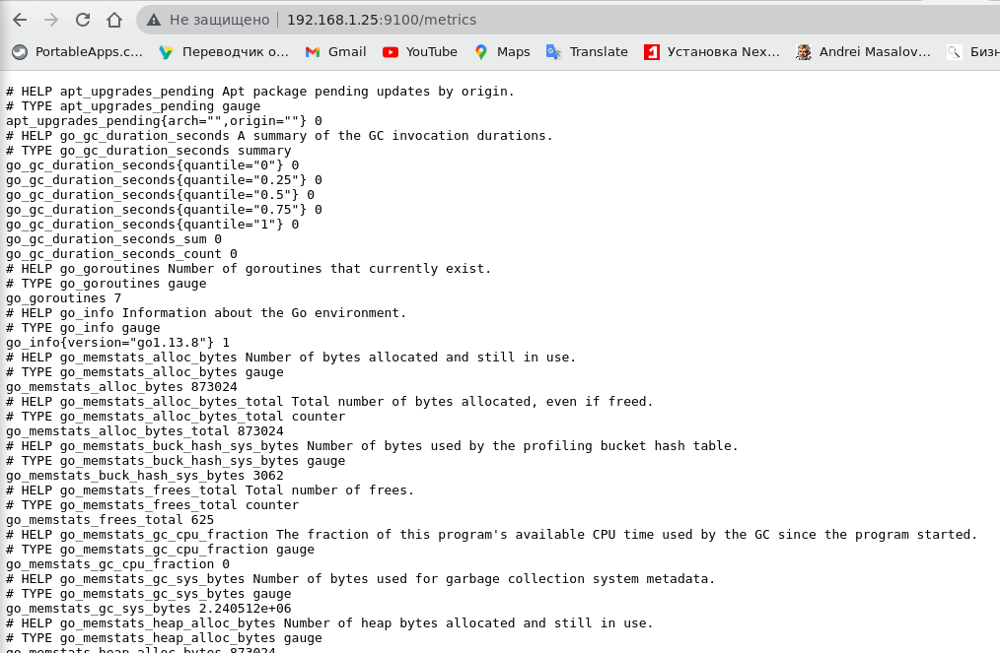
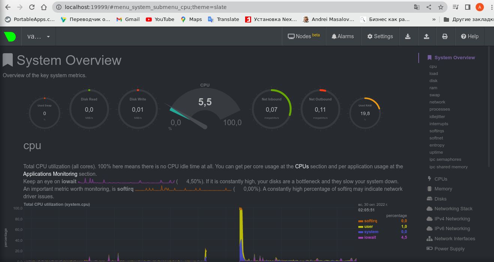

DevOps-netology-23
Vedernikov Alexandr
Домашнее задание к занятию "3.4. Операционные системы. Лекция 2"

1. На лекции мы познакомились с node_exporter. В демонстрации его исполняемый файл 
запускался в background. Этого достаточно для демо, но не для настоящей production-системы, 
где процессы должны находиться под внешним управлением. Используя знания из лекции по 
systemd, создайте самостоятельно простой unit-файл для node_exporter:
   • поместите его в автозагрузку,
   • предусмотрите возможность добавления опций к запускаемому процессу через внешний файл 
(посмотрите, например, на systemctl cat cron),
   • удостоверьтесь, что с помощью systemctl процесс корректно стартует, завершается, а 
после перезагрузки автоматически поднимается.
   Ознакомьтесь с опциями node_exporter и выводом /metrics по-умолчанию. Приведите 
несколько опций, которые вы бы выбрали для базового мониторинга хоста по CPU, памяти, диску 
и сети.
   Решение:
   Внес изменение в конфигурацию Vagrantfile для того чтобы появился сетевой интерфейс 
смотрящий в локальную сеть (виртуальный мост). IP хост машины и IP виртуальной машины 
принадлежали отдной сети.
   vagrant@vagrant:~$ ip add
   1: lo: <LOOPBACK,UP,LOWER_UP> mtu 65536 qdisc noqueue state UNKNOWN group default qlen 1000
   link/loopback 00:00:00:00:00:00 brd 00:00:00:00:00:00
   inet 127.0.0.1/8 scope host lo
   valid_lft forever preferred_lft forever
   inet6 ::1/128 scope host
   valid_lft forever preferred_lft forever
   2: eth0: <BROADCAST,MULTICAST,UP,LOWER_UP> mtu 1500 qdisc fq_codel state UP group default qlen 1000
   link/ether 08:00:27:a2:6b:fd brd ff:ff:ff:ff:ff:ff
   inet 10.0.2.15/24 brd 10.0.2.255 scope global dynamic eth0
   valid_lft 82644sec preferred_lft 82644sec
   inet6 fe80::a00:27ff:fea2:6bfd/64 scope link
   valid_lft forever preferred_lft forever
   3: eth1: <BROADCAST,MULTICAST,UP,LOWER_UP> mtu 1500 qdisc fq_codel state UP group default qlen 1000
   link/ether 08:00:27:a7:7e:98 brd ff:ff:ff:ff:ff:ff
   inet 192.168.1.25/24 brd 192.168.1.255 scope global dynamic eth1
   valid_lft 82644sec preferred_lft 82644sec
   inet6 fe80::a00:27ff:fea7:7e98/64 scope link

   valid_lft forever preferred_lft forever

   

unit — файл для загрузки node_exporter

vagrant@vagrant:~$ cat /etc/systemd/system/node_exporter.service
[Unit]
Description=Node Exporter

[Service]
ExecStart=/usr/local/bin/node_exporter

[Install]
WantedBy=default.target

Добавить сервис в автозагрузку
vagrant@vagrant:~$ systemctl enable node_exporter

проверка работоспособности сервиса.
vagrant@vagrant:~$ ps -e |grep node_exporter
1225 ?        00:00:00 node_exporter

Останавливаем сервис и проверяем остановку
vagrant@vagrant:$ systemctl stop node_exporter
==== AUTHENTICATING FOR org.freedesktop.systemd1.manage-units ===
Authentication is required to stop 'node_exporter.service'.
Authenticating as: vagrant,,, (vagrant)
Password:
==== AUTHENTICATION COMPLETE ===
vagrant@vagrant:$ ps -e |grep node_exporter
Заново стартуем сервис и проверяем
vagrant@vagrant:$ systemctl start node_exporter
==== AUTHENTICATING FOR org.freedesktop.systemd1.manage-units ===
Authentication is required to start 'node_exporter.service'.
Authenticating as: vagrant,,, (vagrant)
Password:
==== AUTHENTICATION COMPLETE ===

vagrant@vagrant:$ ps -e |grep node_exporter
1346 ?        00:00:00 node_exporter
vagrant@vagrant:$

2. Ознакомьтесь с опциями node_exporter и выводом /metrics по-умолчанию. Приведите
   несколько опций, которые вы бы выбрали для базового мониторинга хоста по CPU, памяти, диску
   и сети.

Решение:
CPU:
node_cpu_seconds_total{cpu="0",mode="idle"} 1584.74
nnode_cpu_seconds_total{cpu="0",mode="system"} 19.16
node_cpu_seconds_total{cpu="0",mode="user"} 24.96
process_cpu_seconds_total

Memory:
node_memory_MemAvailable_bytes 6.32897536e+08
node_memory_MemFree_bytes 8.4959232e+07
Disk(если несколько дисков то для каждого):
node_disk_io_time_seconds_total{device="sda"} 28.78
node_disk_read_bytes_total{device="sda"} 6.30495232e+08
node_disk_read_time_seconds_total{device="sda"} 12.672
node_disk_write_time_seconds_total{device="sda"} 20.796

Network(так же для каждого активного адаптера):
node_network_receive_bytes_total{device="eth0"} 5.4651744e+07
node_network_receive_bytes_total{device="eth1"} 3733
node_network_transmit_bytes_total{device="eth0"} 1.350202e+06
node_network_transmit_bytes_total{device="eth1"} 2134

В идеале нужна доп информация. Нужен дополнительный сборщик метрик.
CPU: текущая загрузка по ядрам и LA.
RAM: текущая загрузка, занято User и Kernel, использование памяти top 5 процессами
Disc: занято всего, swap,  использование диска top 5 процессами
Network: общий трафик, трафик в DMZ, внешний трафик

3. Установите в свою виртуальную машину Netdata. Воспользуйтесь готовыми пакетами
для установки (sudo apt install -y netdata).
   После успешной установки:
   ◦ в конфигурационном файле /etc/netdata/netdata.conf в секции [web] замените значение с 
localhost на bind to = 0.0.0.0,
   ◦ добавьте в Vagrantfile проброс порта Netdata на свой локальный компьютер и сделайте
vagrant reload config.vm.network "forwarded_port", guest: 19999, host: 19999
   После успешной перезагрузки в браузере на своем ПК (не в виртуальной машине) вы должны 
суметь зайти на localhost:19999. Ознакомьтесь с метриками, которые по умолчанию собираются 
Netdata и с комментариями, которые даны к этим метрикам.
   Решение:

4. Можно ли по выводу dmesg понять, осознает ли ОС, что загружена не на настоящем 
оборудовании, а на системе виртуализации?
   Решение:
   Да, можно определить, в т.ч. и какая конкретная виртуальная машина.
   vagrant@vagrant:~$ dmesg | grep [v,V]irtu
   [    0.000000] DMI: innotek GmbH VirtualBox/VirtualBox, BIOS VirtualBox 12/01/2006
   [    0.003411] CPU MTRRs all blank - virtualized system.
   [    0.098617] Booting paravirtualized kernel on KVM
   [    3.106428] systemd[1]: Detected virtualization oracle.

5. Как настроен sysctl fs.nr_open на системе по-умолчанию? Определите, что означает 
этот параметр. Какой другой существующий лимит не позволит достичь такого числа 
(ulimit --help)?
   Решение:
   vagrant@vagrant:/$ cat /proc/sys/fs/nr_open
   1048576
максимальное количество файловых дескрипторов, которые может выделить процесс.
Значение по умолчанию — 1024*1024 (1048576)

vagrant@vagrant:/$ cat /proc/sys/fs/file-max
9223372036854775807
Значение в file-max обозначает максимальное количество файловых дескрипторов, которые 
будет выделять ядро Linux.

6. Запустите любой долгоживущий процесс (не ls, который отработает мгновенно, а, например,
sleep 1h) в отдельном неймспейсе процессов; покажите, что ваш процесс работает под PID 1 
через nsenter. Для простоты работайте в данном задании под root (sudo -i). Под обычным 
пользователем требуются дополнительные опции (--map-root-user) и т.д.

Решение:
   root@vagrant:/home/vagrant/test# sudo unshare -f --pid --mount-proc /usr/bin/sleep 1h
   ^Z
   [1]+  Stopped                 sudo unshare -f --pid --mount-proc /usr/bin/sleep 1h
   root@vagrant:/home/vagrant/test# bg
   [1]+ sudo unshare -f --pid --mount-proc /usr/bin/sleep 1h &
   root@vagrant:/home/vagrant/test# ps
   PID TTY          TIME CMD
   17800 pts/1    00:00:00 bash
   18944 pts/1    00:00:00 sudo
   18945 pts/1    00:00:00 unshare
   18946 pts/1    00:00:00 sleep
   18953 pts/1    00:00:00 ps
   root@vagrant:/home/vagrant/test# nsenter --target 18946 --pid --mount
   root@vagrant:/# ps
   PID TTY          TIME CMD
   1 pts/1    00:00:00 sleep
   2 pts/1    00:00:00 bash
   14 pts/1    00:00:00 ps
   root@vagrant:/#

7. Найдите информацию о том, что такое :(){ :|:& };:. Запустите эту команду в своей 
виртуальной машине Vagrant с Ubuntu 20.04 (это важно, поведение в других ОС не проверялось).
Некоторое время все будет "плохо", после чего (минуты) – ОС должна стабилизироваться. 
Вызов dmesg расскажет, какой механизм помог автоматической стабилизации.
   Как настроен этот механизм по-умолчанию, и как изменить число процессов, которое можно 
создать в сессии?
   
Решение:
   Для понятности выражение нужно разбить на
   f() {
   f | f &
   }
таким образом эта функция, которая параллельно пускает два своих экземпляра. Каждый пускает 
ещё по два и т.д. Геометрический рост запущенных процессов.
При отсутствии лимита на число процессов машина быстро исчерпывает физическую память и 
уходит в своп.
   vagrant@vagrant:~/test$ ulimit -u 100
Устанавливаем максимальное количество пользовательских процессов = 100
