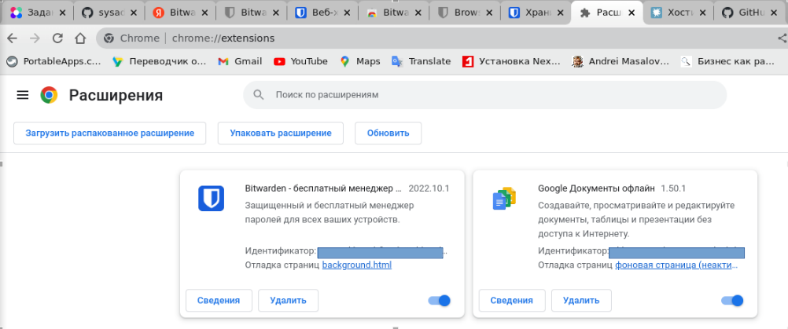
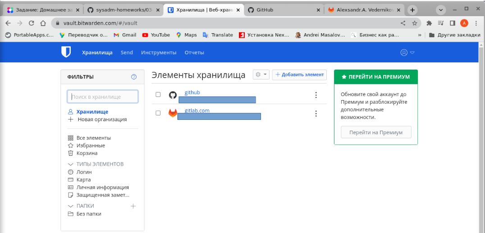
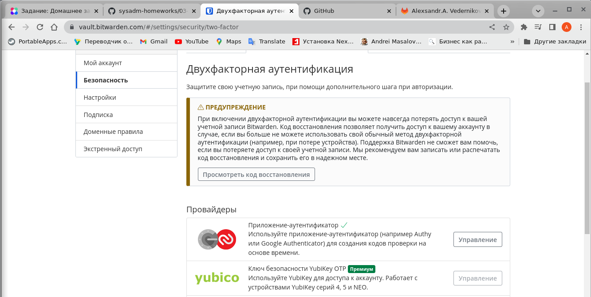
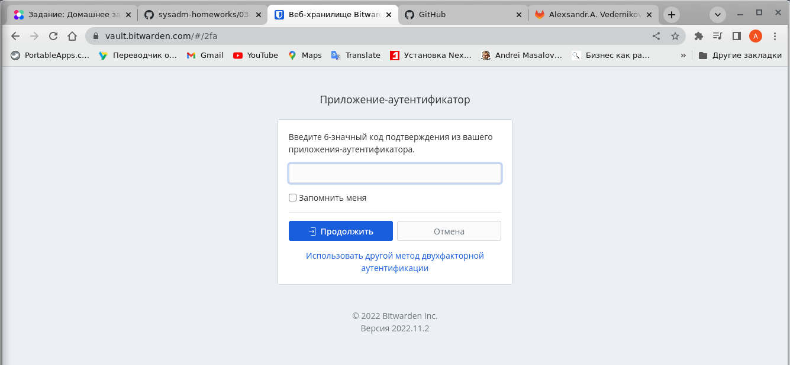
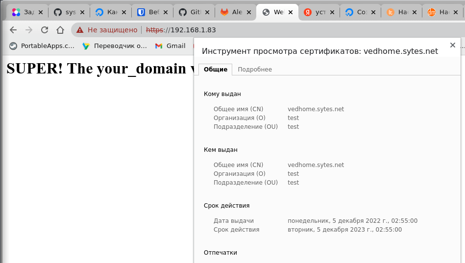
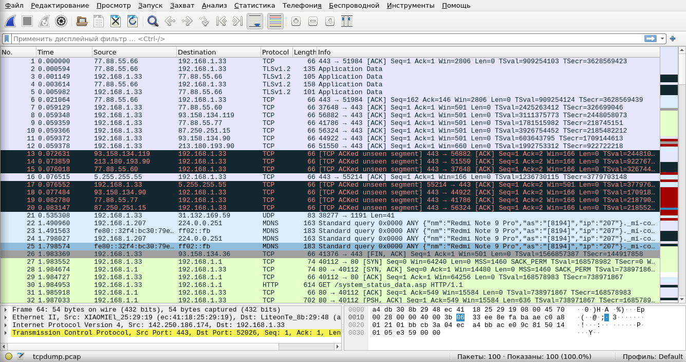

DevOps-netology-23
Vedernikov Alexandr
Домашнее задание к занятию "3.9. Элементы безопасности информационных систем"

**1. Установите Bitwarden плагин для браузера. Зарегистрируйтесь и сохраните несколько 
паролей.**

Решение:

Установить плагин удалось после регистрации из личного кабинета.

Сохранил в личном кабинете сохранил несколько паролей и попробовал с помощью автозаполнения
зайти в эти аккаунты.

**2. Установите Google authenticator на мобильный телефон. Настройте вход в Bitwarden 
аккаунт через Google authenticator OTP.**

Решение:

Установлен на телефон Google authenticator и по средствам QR кода добавлен аккаунт 
Bitwarden. В настройках аккаунта, в разделе "Безопасность" настроена двухфакторная 
аутентификация.

Запрос 6-ти Google authenticator значного кода при входе в аккаунт Bitwarden.

**3. Установите apache2, сгенерируйте самоподписанный сертификат, настройте тестовый сайт 
для работы по HTTPS.**

Решение:

Установлен apache2. Ниже приведен статус сервиса apache2.

>vagrant@vagrant:~$ sudo systemctl status apache2  
>● apache2.service - The Apache HTTP Server  
>     Loaded: loaded (/lib/systemd/system/apache2.service; enabled; vendor preset: enabled)  
>     Active: active (running) since Sun 2022-12-04 22:04:17 UTC; 1min 2s ago  
>       Docs: https://httpd.apache.org/docs/2.4/  
>   Main PID: 802 (apache2)  
>      Tasks: 55 (limit: 1066)  
>     Memory: 9.4M  
>     CGroup: /system.slice/apache2.service  
>             ├─802 /usr/sbin/apache2 -k start  
>             ├─806 /usr/sbin/apache2 -k start  
>             └─807 /usr/sbin/apache2 -k start  
>  
>Dec 04 22:04:16 vagrant systemd[1]: Starting The Apache HTTP Server...  
>Dec 04 22:04:17 vagrant apachectl[771]: AH00558: apache2: Could not reliably determine the server's ful>  
>Dec 04 22:04:17 vagrant systemd[1]: Started The Apache HTTP Server.  

Сгенерирован самоподписанный сертефикат:

>vagrant@vagrant:/etc/apache2/sites-available$ sudo openssl req -x509 -nodes -days 365 -newkey rsa:2048 -keyout 
> /etc/ssl/private/apache-selfsigned.key -out /etc/ssl/certs/apache-selfsigned.crt  
>Generating a RSA private key  
>...............+++++  
>...........+++++  
>writing new private key to '/etc/ssl/private/apache-selfsigned.key'  
>-----  
>You are about to be asked to enter information that will be incorporated  
>into your certificate request.  
>What you are about to enter is what is called a Distinguished Name or a DN.  
>There are quite a few fields but you can leave some blank  
>For some fields there will be a default value,  
>If you enter '.', the field will be left blank.  
>-----  
>Country Name (2 letter code) [AU]:RU  
>State or Province Name (full name) [Some-State]:BRN  
>Locality Name (eg, city) []:BRN  
>Organization Name (eg, company) [Internet Widgits Pty Ltd]:test  
>Organizational Unit Name (eg, section) []:test  
>Common Name (e.g. server FQDN or YOUR name) []:vedhome.sytes.net                                               
>Email Address []:vedernikov.a.a@gmail.com  

Создание сниппета конфигурации Apache с надежными настройками шифрования. Ниже пример конфигурации.

>vagrant@vagrant:/etc/apache2/sites-available$ cat /etc/apache2/conf-available/ssl-params.conf  
>SSLCipherSuite EECDH+AESGCM:EDH+AESGCM:AES256+EECDH:AES256+EDH  
>SSLProtocol All -SSLv2 -SSLv3 -TLSv1 -TLSv1.1  
>SSLHonorCipherOrder On   
>Header always set X-Frame-Options DENY  
>Header always set X-Content-Type-Options nosniff
>SSLCompression off  
>SSLUseStapling on  
>SSLStaplingCache "shmcb:logs/stapling-cache(150000)"   
>SSLSessionTickets Off  

В файле виртуального хоста SSL необходимо прописать пути до ключей SSL:

>vagrant@vagrant:/etc/apache2/sites-available$ cat /etc/apache2/sites-available/default-ssl.conf  
><IfModule mod_ssl.c>  
>	<VirtualHost _default_:443>  
>		ServerAdmin webmaster@localhost  
>		DocumentRoot /var/www/html  
>		#LogLevel info ssl:warn
>		ErrorLog ${APACHE_LOG_DIR}/error.log  
>		CustomLog ${APACHE_LOG_DIR}/access.log combined
>		#   SSL Engine Switch:  
>		#   Enable/Disable SSL for this virtual host.  
>		SSLEngine on  
>		#   SSLCertificateFile directive is needed.  
>		SSLCertificateFile	/etc/ssl/certs/apache-selfsigned.crt  
>		SSLCertificateKeyFile /etc/ssl/private/apache-selfsigned.key  
>		#SSLOptions +FakeBasicAuth +ExportCertData +StrictRequire  
>		<FilesMatch "\.(cgi|shtml|phtml|php)$">  
>				SSLOptions +StdEnvVars  
>		</FilesMatch>  
>		<Directory /usr/lib/cgi-bin>  
>				SSLOptions +StdEnvVars  
>		</Directory>  
>	</VirtualHost>  
></IfModule>  

Необходимо включить модули для использования SSL

>vagrant@vagrant:/etc/apache2/sites-available$ sudo a2enmod ssl  
>Considering dependency setenvif for ssl:  
>Module setenvif already enabled  
>Considering dependency mime for ssl:  
>Module mime already enabled  
>Considering dependency socache_shmcb for ssl:  
>Module socache_shmcb already enabled  
>Module ssl already enabled  
>
>vagrant@vagrant:/etc/apache2/sites-available$ sudo a2enmod headers  
>Enabling module headers.  
>To activate the new configuration, you need to run:  
>  systemctl restart apache2  
>vagrant@vagrant:/etc/apache2/sites-available$ sudo a2enconf ssl-params
>Enabling conf ssl-params.
>To activate the new configuration, you need to run:
>  systemctl reload apache2

Проверяем тестированием конфигурацию Apache2

>vagrant@vagrant:/etc/apache2/sites-available$ sudo apache2ctl configtest
>AH00558: apache2: Could not reliably determine the server's fully qualified domain name, using 127.0.1.1. Set the 'ServerName' directive globally to suppress this message
>Syntax OK

Отключаем дефолтные конфигурации сайта и ssl-модуля. 

>vagrant@vagrant:/etc/apache2/sites-available$ sudo a2dissite 000-default.conf
>Site 000-default already disabled
>vagrant@vagrant:/etc/apache2/sites-available$ sudo a2dissite default-ssl.conf
>Site default-ssl already disabled

Для настройки переадресации с 80 порта (http) на 443 порт (https). Указываю путь к ключам 
для сервера.

>vagrant@vagrant:/etc/apache2/sites-available$ cat /etc/apache2/sites-available/vedhome_sytes_net.conf    
><VirtualHost *:443>    
>   ServerName vedhome.sytes.net    
>   DocumentRoot /var/www/vedhome.sytes.net    
>   SSLEngine on    
>   SSLCertificateFile /etc/ssl/certs/apache-selfsigned.crt    
>   SSLCertificateKeyFile /etc/ssl/private/apache-selfsigned.key    
></VirtualHost>    
>  
><VirtualHost *:80>  
>	ServerName vedhome.sytes.net  
>	Redirect / https://vedhome.sytes.net/  
></VirtualHost>  

В конце настройки перезагружаю демона Apache2.

>vagrant@vagrant:/etc/apache2/sites-available$ sudo systemctl restart apache2

Скрин отображения web сервер и самоподписанный сертификат ssl. 

**4. Проверьте на TLS уязвимости произвольный сайт в интернете (кроме сайтов МВД, ФСБ, МинОбр,
НацБанк, РосКосмос, РосАтом, РосНАНО и любых госкомпаний, объектов КИИ, ВПК ... и тому 
подобное).**

Решение:

TLS - это аббревиатура от Transport Layer Security. TLS можно проверить несколькими 
программами: OpenSSL и NMAP.
Для начала проверим сайт который настраивал в предыдущем задании.

>vagrant@vagrant:/etc/apache2/sites-available$ sudo openssl s_client -connect localhost:443 -tls1_3  
>CONNECTED(00000003)  
>Can't use SSL_get_servername  
>depth=0 C = RU, ST = BRN, L = BRN, O = test, OU = test, CN = vedhome.sytes.net, emailAddress = vedernikov.a.a@gmail.com  
>verify error:num=18:self signed certificate  
>verify return:1  
>depth=0 C = RU, ST = BRN, L = BRN, O = test, OU = test, CN = vedhome.sytes.net, emailAddress = vedernikov.a.a@gmail.com  
>verify return:1  
>---  
>Certificate chain  
> 0 s:C = RU, ST = BRN, L = BRN, O = test, OU = test, CN = vedhome.sytes.net, emailAddress = vedernikov.a.a@gmail.com  
>   i:C = RU, ST = BRN, L = BRN, O = test, OU = test, CN = vedhome.sytes.net, emailAddress = vedernikov.a.a@gmail.com  
>---  
>Server certificate  
>-----BEGIN CERTIFICATE-----  
>MIID+zCCAuOgAwIBAgIUHVlP0fsqaGvRdFJ5NI9xLMYK6LswDQYJKoZIhvcNAQEL  
>BQAwgYwxCzAJBgNVBAYTAlJVMQwwCgYDVQQIDANCUk4xDDAKBgNVBAcMA0JSTjEN  
>MAsGA1UECgwEdGVzdDENMAsGA1UECwwEdGVzdDEaMBgGA1UEAwwRdmVkaG9tZS5z  
>eXRlcy5uZXQxJzAlBgkqhkiG9w0BCQEWGHZlZGVybmlrb3YuYS5hQGdtYWlsLmNv  
>bTAeFw0yMjEyMDQyMzU1MDBaFw0yMzEyMDQyMzU1MDBaMIGMMQswCQYDVQQGEwJS  
>VTEMMAoGA1UECAwDQlJOMQwwCgYDVQQHDANCUk4xDTALBgNVBAoMBHRlc3QxDTAL  
>BgNVBAsMBHRlc3QxGjAYBgNVBAMMEXZlZGhvbWUuc3l0ZXMubmV0MScwJQYJKoZI  
>hvcNAQkBFhh2ZWRlcm5pa292LmEuYUBnbWFpbC5jb20wggEiMA0GCSqGSIb3DQEB  
>AQUAA4IBDwAwggEKAoIBAQDBnmR0oc9TK+t0/plyU9Ov+6y8mbg3jOqm8UdcfBAf  
>lqO/CPctPLralMnDVzNhjiWY0gcD5mnznImdUTodR8x7D1DbyWfRzpGp4d1RMn8c  
>VzsNgOfJCh4eShTgESNIIgqWRsjCMsUuNCaze/g+UYc0EES6lTMd3uTj4U0c1dZV  
>GaCctX6sgk5lyu4YAPBpK9/EZ79sVpVl4dgMMeDy2rP8GSJQR/F+yzdW+uNvKjay  
>pFVDi9ejZUMvZOd6b27rcgIvxEeLqJ0PNyGAPViW9NI+4h5WRXfAM+C+QRrZFbVb  
>av3e+YkFZZq2LrBKFT5FHcz5+JKst8m6upkT0MylxEdNAgMBAAGjUzBRMB0GA1Ud  
>DgQWBBS2N1za3UOGYltUuf7n82l2uRng8DAfBgNVHSMEGDAWgBS2N1za3UOGYltU  
>uf7n82l2uRng8DAPBgNVHRMBAf8EBTADAQH/MA0GCSqGSIb3DQEBCwUAA4IBAQCr  
>Kk5RpfpDOvuiyxFK2IL5h+YKYGmNLeV/kJgrrUNMucyyFhQL7tjnDcYYbLeQwxNX  
>dYWU0+S6frBEN+Xr+OybXM37aYPy+1pLGlZpk0hPO7T8jssMMr0I7NyIbTIG7jS+  
>eO2ioTiq4ADHBGdG1hFcrXVsqWGgPub7YvMmXGghZlz/cAqw4g1GmMjukJeaLHLD  
>ztGF3efFt2ixFFyQ6drnBIoxA/n4RaW3GvvXbkCOmYfVvwRwjDpBszl0hTyBH+wG  
>9ZZBmKd5JCI6d5+eqa+qZEUx+7ERIi2DHp+qID5SoCyJ8Kcf22Yo+Ktp2mrad+UA  
>KjLkza3A/CWp1jopxo1J  
>-----END CERTIFICATE-----  
>subject=C = RU, ST = BRN, L = BRN, O = test, OU = test, CN = vedhome.sytes.net, emailAddress = vedernikov.a.a@gmail.com  
>  
>issuer=C = RU, ST = BRN, L = BRN, O = test, OU = test, CN = vedhome.sytes.net, emailAddress = vedernikov.a.a@gmail.com  
>  
>---  
>No client certificate CA names sent  
>Peer signing digest: SHA256  
>Peer signature type: RSA-PSS  
>Server Temp Key: X25519, 253 bits  
>---  
>SSL handshake has read 1579 bytes and written 295 bytes  
>Verification error: self signed certificate  
>---  
>New, TLSv1.3, Cipher is TLS_AES_256_GCM_SHA384  
>Server public key is 2048 bit  
>Secure Renegotiation IS NOT supported  
>Compression: NONE  
>Expansion: NONE  
>No ALPN negotiated  
>Early data was not sent  
>Verify return code: 18 (self signed certificate)  
>---  
>---  
>Post-Handshake New Session Ticket arrived:  
>SSL-Session:  
>    Protocol  : TLSv1.3  
>    Cipher    : TLS_AES_256_GCM_SHA384  
>    Session-ID: 3AD98FA852E4382EEF349D0FDF21C446731A943FD93FBD7ABE666FE0F8B66FBC  
>    Session-ID-ctx:   
>    Resumption PSK: 80401AB8F303E4AFBE04F00DA6D8C9938F34C4919041144C7C27880AF9D437F35C9EE37C101FD6FA23DAE45BAE9791BE  
>    PSK identity: None  
>    PSK identity hint: None  
>    SRP username: None  
>    TLS session ticket lifetime hint: 300 (seconds)  
>    TLS session ticket:  
>    0000 - c7 9c df 47 d7 47 35 44-c1 f5 94 01 21 ca 35 f0   ...G.G5D....!.5.  
>    0010 - 1e 54 bb 77 4a 70 ea 59-8e 75 e2 65 f6 ab b9 24   .T.wJp.Y.u.e...$  
>  
>    Start Time: 1670273337  
>    Timeout   : 7200 (sec)  
>    Verify return code: 18 (self signed certificate)  
>    Extended master secret: no  
>    Max Early Data: 0  
>---  
>    read R BLOCK  
>---  
>Post-Handshake New Session Ticket arrived:  
>SSL-Session:  
>    Protocol  : TLSv1.3  
>    Cipher    : TLS_AES_256_GCM_SHA384  
>    Session-ID: D3CE4C01846B0A6477DCE00BFB078EDAC37FB5847FEF7788822FB40A9DE0A743  
>    Session-ID-ctx:   
>    Resumption PSK: 04E7CEBFEFBEAF88C8D4179DB75A7AF902659C94888C7F0FC73FEF35EB731F2BF63043C8331ACE2F5B159F9B5017D55C  
>    PSK identity: None  
>    PSK identity hint: None  
>    SRP username: None  
>    TLS session ticket lifetime hint: 300 (seconds)  
>    TLS session ticket:  
>    0000 - 75 65 fe 29 3c d0 ad 86-ca 5b d1 3a 91 07 79 df   ue.)<....[.:..y.  
>    0010 - a0 45 ef d0 59 a6 f7 07-2f 58 3e 70 f5 1c 68 56   .E..Y.../X>p..hV  
>  
>    Start Time: 1670273337  
>    Timeout   : 7200 (sec)  
>    Verify return code: 18 (self signed certificate)  
>    Extended master secret: no  
>    Max Early Data: 0  
>---  
>read R BLOCK  
>closed  

В выводе команды видно:  
- что используется самоподписанный сертификат  
- используется метод шифрования TLS_AES_256_GCM_SHA384  
- Длина публичного ключа 2048 bit    

Проверим локальный сайт с помощью NMAP.

>vagrant@vagrant:/etc/apache2/sites-available$ nmap --script ssl-enum-ciphers -p 443 localhost  
>Starting Nmap 7.80 ( https://nmap.org ) at 2022-12-05 20:54 UTC  
>Nmap scan report for localhost (127.0.0.1)  
>Host is up (0.00012s latency).  
>  
>PORT    STATE SERVICE  
>443/tcp open  https  
>| ssl-enum-ciphers:   
>|   TLSv1.2:   
>|     ciphers:   
>|       TLS_ECDHE_RSA_WITH_AES_256_GCM_SHA384 (ecdh_x25519) - A  
>|       TLS_ECDHE_RSA_WITH_AES_128_GCM_SHA256 (ecdh_x25519) - A  
>|       TLS_DHE_RSA_WITH_AES_256_GCM_SHA384 (dh 2048) - A  
>|       TLS_DHE_RSA_WITH_AES_128_GCM_SHA256 (dh 2048) - A  
>|       TLS_ECDHE_RSA_WITH_AES_256_CBC_SHA384 (ecdh_x25519) - A  
>|       TLS_ECDHE_RSA_WITH_AES_256_CBC_SHA (ecdh_x25519) - A  
>|       TLS_DHE_RSA_WITH_AES_256_CCM_8 (dh 2048) - A  
>|       TLS_DHE_RSA_WITH_AES_256_CCM (dh 2048) - A  
>|       TLS_DHE_RSA_WITH_AES_256_CBC_SHA256 (dh 2048) - A  
>|       TLS_DHE_RSA_WITH_AES_256_CBC_SHA (dh 2048) - A  
>|     compressors:   
>|       NULL  
>|     cipher preference: server  
>|_  least strength: A  
>  
>Nmap done: 1 IP address (1 host up) scanned in 0.52 seconds  

В выводе команды видно какие методы шифрования поддерживаются и какие длимы ключей применяются

Те же самые команды применим для yandex.ru

>vagrant@vagrant:/etc/apache2/sites-available$ sudo openssl s_client -connect yandex.ru:443 -tls1_3  
>CONNECTED(00000003)  
>depth=2 OU = GlobalSign ECC Root CA - R5, O = GlobalSign, CN = GlobalSign  
>verify return:1  
>depth=1 C = BE, O = GlobalSign nv-sa, CN = GlobalSign ECC OV SSL CA 2018  
>verify return:1  
>depth=0 C = RU, ST = Moscow, L = Moscow, O = Yandex LLC, CN = *.xn--d1acpjx3f.xn--p1ai  
>verify return:1  
>---  
>Certificate chain  
> 0 s:C = RU, ST = Moscow, L = Moscow, O = Yandex LLC, CN = *.xn--d1acpjx3f.xn--p1ai  
>   i:C = BE, O = GlobalSign nv-sa, CN = GlobalSign ECC OV SSL CA 2018  
> 1 s:C = BE, O = GlobalSign nv-sa, CN = GlobalSign ECC OV SSL CA 2018  
>   i:OU = GlobalSign ECC Root CA - R5, O = GlobalSign, CN = GlobalSign  
> 2 s:OU = GlobalSign ECC Root CA - R5, O = GlobalSign, CN = GlobalSign  
>   i:C = BE, O = GlobalSign nv-sa, OU = Root CA, CN = GlobalSign Root CA  
>---  
>Server certificate  
>-----BEGIN CERTIFICATE-----  
>MIIHjTCCBxOgAwIBAgIMIkrpG87ttU3zY7WTMAoGCCqGSM49BAMDMFAxCzAJBgNV  
>BAYTAkJFMRkwFwYDVQQKExBHbG9iYWxTaWduIG52LXNhMSYwJAYDVQQDEx1HbG9i  
>YWxTaWduIEVDQyBPViBTU0wgQ0EgMjAxODAeFw0yMjA4MTkxMDE5MjFaFw0yMzAy   
>MTYyMDU5NTlaMGcxCzAJBgNVBAYTAlJVMQ8wDQYDVQQIEwZNb3Njb3cxDzANBgNV  
>BAcTBk1vc2NvdzETMBEGA1UEChMKWWFuZGV4IExMQzEhMB8GA1UEAwwYKi54bi0t  
>ZDFhY3BqeDNmLnhuLS1wMWFpMFkwEwYHKoZIzj0CAQYIKoZIzj0DAQcDQgAEc38Q  
>2M/1vE8dX7zDtbv4Z74MYyx05+dcE5dxav5ddPCLUg+FCvzhndLQFSWLLaXlKw+J  
>8osAeq9/B146PA/GdaOCBbowggW2MA4GA1UdDwEB/wQEAwIHgDCBjgYIKwYBBQUH  
>AQEEgYEwfzBEBggrBgEFBQcwAoY4aHR0cDovL3NlY3VyZS5nbG9iYWxzaWduLmNv  
>bS9jYWNlcnQvZ3NlY2NvdnNzbGNhMjAxOC5jcnQwNwYIKwYBBQUHMAGGK2h0dHA6  
>Ly9vY3NwLmdsb2JhbHNpZ24uY29tL2dzZWNjb3Zzc2xjYTIwMTgwVgYDVR0gBE8w  
>TTBBBgkrBgEEAaAyARQwNDAyBggrBgEFBQcCARYmaHR0cHM6Ly93d3cuZ2xvYmFs  
>c2lnbi5jb20vcmVwb3NpdG9yeS8wCAYGZ4EMAQICMAkGA1UdEwQCMAAwPwYDVR0f  
>BDgwNjA0oDKgMIYuaHR0cDovL2NybC5nbG9iYWxzaWduLmNvbS9nc2VjY292c3Ns  
>Y2EyMDE4LmNybDCCAosGA1UdEQSCAoIwggJ+ghgqLnhuLS1kMWFjcGp4M2YueG4t  
>LXAxYWmCC3lhbmRleC5hZXJvgg0qLnlhbmRleC5hZXJvggt5YW5kZXguam9ic4IN  
>Ki55YW5kZXguam9ic4IKeWFuZGV4Lm5ldIIMKi55YW5kZXgubmV0ggp5YW5kZXgu  
>b3JnggwqLnlhbmRleC5vcmeCCXlhbmRleC5kZYILKi55YW5kZXguZGWCBXlhLnJ1  
>ggcqLnlhLnJ1ggl5YW5kZXgudXqCCyoueWFuZGV4LnV6ggl5YW5kZXgudG2CCyou  
>eWFuZGV4LnRtggl5YW5kZXgudGqCCyoueWFuZGV4LnRqggl5YW5kZXgucnWCCyou  
>eWFuZGV4LnJ1ggl5YW5kZXgubWSCCyoueWFuZGV4Lm1kggl5YW5kZXgubHaCCyou  
>eWFuZGV4Lmx2ggl5YW5kZXgubHSCCyoueWFuZGV4Lmx0ggl5YW5kZXgua3qCCyou  
>eWFuZGV4Lmt6ggl5YW5kZXguZnKCCyoueWFuZGV4LmZyggl5YW5kZXguZWWCCyou  
>eWFuZGV4LmVlgg15YW5kZXguY29tLnRygg8qLnlhbmRleC5jb20udHKCDXlhbmRl  
>eC5jb20uZ2WCDyoueWFuZGV4LmNvbS5nZYINeWFuZGV4LmNvbS5hbYIPKi55YW5k  
>ZXguY29tLmFtggp5YW5kZXguY29tggwqLnlhbmRleC5jb22CDHlhbmRleC5jby5p  
>bIIOKi55YW5kZXguY28uaWyCCXlhbmRleC5ieYILKi55YW5kZXguYnmCCXlhbmRl  
>eC5heoILKi55YW5kZXguYXqCFnhuLS1kMWFjcGp4M2YueG4tLXAxYWkwHQYDVR0l  
>BBYwFAYIKwYBBQUHAwEGCCsGAQUFBwMCMB8GA1UdIwQYMBaAFFh7jnUq/mGAqpBA  
>Aa7W6AdGbj9IMB0GA1UdDgQWBBRbK3YeQOEEYiqa5spLc1Cwt6OdQDCCAX8GCisG  
>AQQB1nkCBAIEggFvBIIBawFpAHYA6D7Q2j71BjUy51covIlryQPTy9ERa+zraeF3  
>fW0GvW4AAAGCtZ1WZQAABAMARzBFAiEA+YTEuSkO0dOJELwyKFDFs+5zn/yFPfAN  
>4LHhURKRAXcCIBTkh7/xwNpNIDuYQn+dSpvV7kTgLKZA8FlT+ICaHRw/AHYAb1N2  
>rDHwMRnYmQCkURX/dxUcEdkCwQApBo2yCJo32RMAAAGCtZ1UEgAABAMARzBFAiBf  
>bGa8za/ryTZH4YPcpQ3YU/HxhBslAZlEeYzKM2yZOAIhAMFsrWa7dPO5bjfDHiXo  
>zezg71Hb+eVNsyxjTEgB63OBAHcAs3N3B+GEUPhjhtYFqdwRCUp5LbFnDAuH3PAD  
>Dnk2pZoAAAGCtZ1VDwAABAMASDBGAiEA7Wt7kOuES5phUaUDyNicv7kRSCwKW2Lz  
>8VznLoXFvecCIQCsZuByRax6iXLwt0Jzvm8qbP/fp0MNtpymZC+rRZ2jfDAKBggq  
>hkjOPQQDAwNoADBlAjA27hUwUSCgLmgAMlNPF4pzywYmu4Cr+wYzCAeH7FhYKgZS  
>16xE//9oP5B28TcJQLcCMQDzvWujkEAnZx0vcToga2/g/UMvKAcCa7EG0HF+tVAi  
>IS5tww6xNlUh+8oV4lpJVY0=  
>-----END CERTIFICATE-----  
>subject=C = RU, ST = Moscow, L = Moscow, O = Yandex LLC, CN = *.xn--d1acpjx3f.xn--p1ai  
>  
>issuer=C = BE, O = GlobalSign nv-sa, CN = GlobalSign ECC OV SSL CA 2018  
>  
>---  
>No client certificate CA names sent  
>Peer signing digest: SHA256  
>Peer signature type: ECDSA  
>Server Temp Key: X25519, 253 bits  
>---  
>SSL handshake has read 4031 bytes and written 313 bytes  
>Verification: OK  
>---  
>New, TLSv1.3, Cipher is TLS_AES_256_GCM_SHA384  
>Server public key is 256 bit  
>Secure Renegotiation IS NOT supported  
>Compression: NONE  
>Expansion: NONE  
>No ALPN negotiated  
>Early data was not sent  
>Verify return code: 0 (ok)  
>---  
>---  
>Post-Handshake New Session Ticket arrived:  
>SSL-Session:  
>    Protocol  : TLSv1.3  
>    Cipher    : TLS_AES_256_GCM_SHA384  
>    Session-ID: 02060F491E73AC8F732236CA42AEE755120004D0354DFB2F3BFAFA5C12D74065  
>    Session-ID-ctx:   
>    Resumption PSK: C734AAC88C11DA95B562CDF8A81A0DC126F1E33472378BE160D605BD78C1234537CB055F6A292D6B4DE7A7090E49FC0F  
>    PSK identity: None  
>    PSK identity hint: None  
>    SRP username: None  
>    TLS session ticket lifetime hint: 100800 (seconds)  
>    TLS session ticket:  
>    0000 - 87 cf 10 30 64 46 4c 86-82 33 71 09 fa 37 4d 9e   ...0dFL..3q..7M.  
>    0010 - 7e 55 b7 09 41 22 ed b8-c9 72 56 8b 6e a9 6f 09   ~U..A"...rV.n.o.  
>    0020 - cb 08 3a c0 fc e8 77 69-e6 29 27 ef 4a 0e 0f 67   ..:...wi.)'.J..g  
>    0030 - d8 10 b4 0c d1 8b 99 6e-56 a2 3c 71 6e 63 5c e2   .......nV.<qnc\.  
>    0040 - a7 ea ae a0 c6 1f ed 80-7e 9c 40 ae 0d 3d 58 49   ........~.@..=XI  
>    0050 - 3f c5 8e 9b e5 ef c6 33-0d 87 f2 f9 3d c8 3b ef   ?......3....=.;.  
>    0060 - f3 a4 d8 59 7d cb 4a fb-74 f9 87 76 3a 99 cd a7   ...Y}.J.t..v:...  
>    0070 - b3 9d 2f 55 15 62 2a 35-5a 8e 8b 90 fd a8 19 da   ../U.b*5Z.......  
>    0080 - f7 c6 75 a6 4d 32 12 1e-65 ee f6 5a d6 5d e4 43   ..u.M2..e..Z.].C  
>    0090 - 9a cc c8 8c 4b 74 65 2a-2a ae 84 b8 5d 7e 07 40   ....Kte**...]~.@  
>    00a0 - 99 7a 49 80 37 87 c7 8a-33 47 19 9c 2f ef 9c 02   .zI.7...3G../...  
>    00b0 - ba c6 20 49 b3 4e fe 81-5e 15 01 aa a5 5e 55 f8   .. I.N..^....^U.  
>  
>    Start Time: 1670275553  
>    Timeout   : 7200 (sec)  
>    Verify return code: 0 (ok)  
>    Extended master secret: no  
>    Max Early Data: 0  
>---  
>read R BLOCK  
>---  
>Post-Handshake New Session Ticket arrived:  
>SSL-Session:  
>    Protocol  : TLSv1.3  
>    Cipher    : TLS_AES_256_GCM_SHA384  
>    Session-ID: 8C235B949A11F52BD4E6158A07F3F7DF52C5E019C81FF6762D20BF89262B0893  
>    Session-ID-ctx:   
>    Resumption PSK: 479C6A8A7721890CFFCAC5B43DC89DF1990971FA260B3FB9E81B24DCAF504D9C3B36A97E978330D48072A901F7369025  
>    PSK identity: None  
>    PSK identity hint: None  
>    SRP username: None  
>    TLS session ticket lifetime hint: 100800 (seconds)  
>    TLS session ticket:  
>    0000 - 87 cf 10 30 64 46 4c 86-82 33 71 09 fa 37 4d 9e   ...0dFL..3q..7M.  
>    0010 - 7c 5a 4e ca 6d 6a f7 85-23 55 f4 4a 65 69 30 d3   |ZN.mj..#U.Jei0.  
>    0020 - c8 fa 4d 04 43 c9 78 a7-37 84 36 f3 e5 5f 38 73   ..M.C.x.7.6.._8s  
>    0030 - a1 45 e8 65 1a 05 c1 f4-4c 8b c1 d4 6b 0f 84 8f   .E.e....L...k...  
>    0040 - 11 a3 1d cc 25 18 aa ef-99 64 a6 c6 07 17 e9 f1   ....%....d......  
>    0050 - 82 2c 33 2a df 8b 51 cf-c8 26 c6 12 54 69 fe 39   .,3*..Q..&..Ti.9  
>    0060 - 25 cd 1c 0e 9b 4e 34 76-9d 39 38 55 c6 cd 5c 62   %....N4v.98U..\b  
>    0070 - ce e4 23 0c c7 26 30 17-6e 1c 7d d0 bf be b8 01   ..#..&0.n.}.....    
>    0080 - 40 76 61 49 d4 eb ee 5f-77 2a d5 7a 53 5d 01 bb   @vaI..._w*.zS]..   
>    0090 - 38 62 28 36 41 ff 27 ee-cc 68 f1 1c d6 c7 e8 3b   8b(6A.'..h.....;  
>    00a0 - 61 75 93 7d 07 51 df 34-97 d0 fb da 86 16 3c 26   au.}.Q.4......<&  
>    00b0 - a3 a7 5a 2a 68 ba 32 83-b8 69 60 ad 93 dd f3 7e   ..Z*h.2..i`....~  
>  
>    Start Time: 1670275553  
>    Timeout   : 7200 (sec)  
>    Verify return code: 0 (ok)  
>    Extended master secret: no  
>    Max Early Data: 0  
>---  
>read R BLOCK  
>closed    

Проверим yandex.ru с помощью NMAP.

>vagrant@vagrant:/etc/apache2/sites-available$ nmap --script ssl-enum-ciphers -p 443 yandex.ru  
>Starting Nmap 7.80 ( https://nmap.org ) at 2022-12-05 20:55 UTC  
>Nmap scan report for yandex.ru (5.255.255.55)  
>Host is up (0.013s latency).  
>Other addresses for yandex.ru (not scanned): 5.255.255.50 77.88.55.66 77.88.55.70 2a02:6b8:a::a  
>  
>PORT    STATE SERVICE  
>443/tcp open  https  
>| ssl-enum-ciphers:   
>|   TLSv1.0:   
>|     ciphers:   
>|       TLS_ECDHE_ECDSA_WITH_AES_128_CBC_SHA (ecdh_x25519) - A  
>|       TLS_ECDHE_RSA_WITH_AES_128_CBC_SHA (ecdh_x25519) - A  
>|     compressors:   
>|       NULL  
>|     cipher preference: server  
>|   TLSv1.1:   
>|     ciphers:   
>|       TLS_ECDHE_ECDSA_WITH_AES_128_CBC_SHA (ecdh_x25519) - A  
>|       TLS_ECDHE_RSA_WITH_AES_128_CBC_SHA (ecdh_x25519) - A  
>|     compressors:   
>|       NULL  
>|     cipher preference: server  
>|   TLSv1.2:   
>|     ciphers:   
>|       TLS_ECDHE_ECDSA_WITH_CHACHA20_POLY1305_SHA256 (ecdh_x25519) - A  
>|       TLS_ECDHE_RSA_WITH_CHACHA20_POLY1305_SHA256 (ecdh_x25519) - A  
>|       TLS_ECDHE_ECDSA_WITH_AES_128_GCM_SHA256 (ecdh_x25519) - A  
>|       TLS_ECDHE_RSA_WITH_AES_128_GCM_SHA256 (ecdh_x25519) - A  
>|       TLS_ECDHE_ECDSA_WITH_AES_128_CCM_8 (ecdh_x25519) - A  
>|       TLS_ECDHE_ECDSA_WITH_AES_128_CCM (ecdh_x25519) - A  
>|       TLS_ECDHE_ECDSA_WITH_AES_128_CBC_SHA256 (ecdh_x25519) - A  
>|       TLS_ECDHE_RSA_WITH_AES_128_CBC_SHA256 (ecdh_x25519) - A  
>|       TLS_ECDHE_ECDSA_WITH_AES_128_CBC_SHA (ecdh_x25519) - A  
>|       TLS_ECDHE_RSA_WITH_AES_128_CBC_SHA (ecdh_x25519) - A  
>|       TLS_ECDHE_ECDSA_WITH_AES_256_GCM_SHA384 (ecdh_x25519) - A  
>|       TLS_ECDHE_RSA_WITH_AES_256_GCM_SHA384 (ecdh_x25519) - A  
>|       TLS_RSA_WITH_AES_128_GCM_SHA256 (rsa 2048) - A  
>|       TLS_RSA_WITH_AES_128_CCM_8 (rsa 2048) - A  
>|       TLS_RSA_WITH_AES_128_CCM (rsa 2048) - A  
>|       TLS_RSA_WITH_AES_128_CBC_SHA256 (rsa 2048) - A  
>|     compressors:   
>|       NULL  
>|     cipher preference: server  
>|_  least strength: A  
>  
>Nmap done: 1 IP address (1 host up) scanned in 2.95 seconds  

**5. Установите на Ubuntu ssh сервер, сгенерируйте новый приватный ключ. Скопируйте свой 
публичный ключ на другой сервер. Подключитесь к серверу по SSH-ключу.**

Решение:

Проверим уставку на пакета OpenSSH-server нф машине Vagrant.

>vagrant@vagrant:/$ sudo apt install openssh-server  
>Reading package lists... Done  
>Building dependency tree          
>Reading state information... Done  
>openssh-server is already the newest version (1:8.2p1-4ubuntu0.5).  
>0 upgraded, 0 newly installed, 0 to remove and 125 not upgraded.  

Остальные действия проводим на host машине.  
Генерируем пару ssh ключей. 

>home@home:~$ ssh-keygen   
>Generating public/private rsa key pair.  
>Enter file in which to save the key (/home/home/.ssh/id_rsa):   
>Enter passphrase (empty for no passphrase):   
>Enter same passphrase again:   
>Your identification has been saved in /home/home/.ssh/id_rsa  
>Your public key has been saved in /home/home/.ssh/id_rsa.pub  
>The key fingerprint is:  
>SHA256:ZQ52mhyxKk8/YAcvPboo81vq5nfZtu8LgeeY9AgQdOc home@home  
>The key's randomart image is:  
> 
> *+---[RSA 3072]----+  
>|   .o . o        |  
>|     o o o       |  
>|    . . E +      |  
>|     . B @       |  
>|    . B S +      |  
>|     = O O .     |  
>|      + *o+      |  
>|  o .+..o.o.     |  
>|   BBo.. ..++.   |  
>+----[SHA256]-----+  

Копируем публичный ключ с host машины на vagrant машину, указав ее ip. А также явно 
указываем имя пользователя под которым будем в будущем входить на удаленный сервер.   

>home@home:~$ ssh-copy-id vagrant@192.168.1.83  
>/usr/bin/ssh-copy-id: INFO: Source of key(s) to be installed: "/home/home/.ssh/id_rsa.pub"  
>The authenticity of host '192.168.1.83 (192.168.1.83)' can't be established.  
>ED25519 key fingerprint is SHA256:pwWLELJ830QYLt82Q6zuODmsnTjoxxLFI0Aw2dvRSHg.  
>This key is not known by any other names.  
>Are you sure you want to continue connecting (yes/no/[fingerprint])? y  
>Please type 'yes', 'no' or the fingerprint: yes  
>/usr/bin/ssh-copy-id: INFO: attempting to log in with the new key(s), to filter out any that are already installed  
>/usr/bin/ssh-copy-id: INFO: 1 key(s) remain to be installed -- if you are prompted now it is to install the new keys  
>vagrant@192.168.1.83's password:   
>  
>Number of key(s) added: 1  
>  
>Now try logging into the machine, with:   "ssh 'vagrant@192.168.1.83'"  
>and check to make sure that only the key(s) you wanted were added.  

Пробуем войти по ssh с host машины на vagrant машину 

>home@home:~$ ssh vagrant@192.168.1.83  
>Enter passphrase for key '/home/home/.ssh/id_rsa':   
>Welcome to Ubuntu 20.04.4 LTS (GNU/Linux 5.4.0-110-generic x86_64)  
>  
> * Documentation:  https://help.ubuntu.com  
> * Management:     https://landscape.canonical.com  
> * Support:        https://ubuntu.com/advantage  
>  
>  System information as of Mon 05 Dec 2022 09:57:19 PM UTC  
>  
>  System load:  0.0                Processes:             129  
>  Usage of /:   13.2% of 30.63GB   Users logged in:       1  
>  Memory usage: 24%                IPv4 address for eth0: 10.0.2.15  
>  Swap usage:   0%                 IPv4 address for eth1: 192.168.1.83  
>  
>  
>This system is built by the Bento project by Chef Software  
>More information can be found at https://github.com/chef/bento  
>Last login: Sun Dec  4 22:04:57 2022 from 10.0.2.2  
>vagrant@vagrant:  

**6. Переименуйте файлы ключей из задания 5. Настройте файл конфигурации SSH клиента, так 
чтобы вход на удаленный сервер осуществлялся по имени сервера.**

Решение:

На Vagrant машине необходимо отключить аутентификацию по паролю. Для этого необходимо в 
файле /etc/ssh/sshd_config раскомментировать директиву PasswordAuthentication. И установить
ей значение "no".

>vagrant@vagrant:/$ cat /etc/ssh/sshd_config    
>Include /etc/ssh/sshd_config.d/*.conf  
> 
>PasswordAuthentication no  
> 
>ChallengeResponseAuthentication no  
>UsePAM yes  
>X11Forwarding yes  
>PrintMotd no  
>AcceptEnv LANG LC_*  
>Subsystem sftp	/usr/lib/openssh/sftp-server   
>UseDNS no  
>GSSAPIAuthentication no  

После сохранения конфигурационного файла необходимо перегрузить демон ssh.

>vagrant@vagrant:/$ sudo systemctl restart ssh

На host машине сделаем конфигурацию, чтобы входить по имени сервера.
В конфигурации (Host vagrhost) явно указываем:
* имя сервера ко которому будем входить.
* имя пользователя 
* расположение ключа

>home@home:~$ cat ~/.ssh/config  
>Host github.com/Alexandr-Vedernikov/devops-netology  
>        Hostname github.com  
>        IdentityFile=/home/user/.ssh/id_ed25519  
>  
>Host vagrant  
>    HostName 127.0.0.1  
>    Port 2222  
>    User vagrant  
>    RequestTTY force  
>  
>Host vagrhost    
>    HostName 192.168.1.83   
>    User vagrant  
>    IdentityFile ~/.ssh/id_rsa  

После сохранения файла конфигурации пробуем войди на vagrant машину.

>home@home:~$ ssh vagrhost  
>Enter passphrase for key '/home/home/.ssh/id_rsa':   
>Welcome to Ubuntu 20.04.4 LTS (GNU/Linux 5.4.0-110-generic x86_64)  
>  
> * Documentation:  https://help.ubuntu.com  
> * Management:     https://landscape.canonical.com  
> * Support:        https://ubuntu.com/advantage  
>  
>  System information as of Mon 05 Dec 2022 11:02:27 PM UTC  
>  
>  System load:  0.0                Processes:             131  
>  Usage of /:   13.2% of 30.63GB   Users logged in:       1  
>  Memory usage: 25%                IPv4 address for eth0: 10.0.2.15  
>  Swap usage:   0%                 IPv4 address for eth1: 192.168.1.83  
>  
>  
>This system is built by the Bento project by Chef Software  
>More information can be found at https://github.com/chef/bento  
>Last login: Mon Dec  5 23:01:31 2022 from 192.168.1.33  
>vagrant@vagrant:~$  

**7. Соберите дамп трафика утилитой tcpdump в формате pcap, 100 пакетов. Откройте файл 
pcap в Wireshark.**

Решение:

Устанавливаем tcpdump и wireshark

>home@home:~$ sudo apt install tcpdump
>home@home:~$ sudo apt install wireshark

Собираем дамп трафика со всех интерфейсов host машины. Вывод дампа перенаправляем в файл.

>home@home:~$ sudo tcpdump -c 100 -w tcpdump.pcap  
>tcpdump: listening on wlo1, link-type EN10MB (Ethernet), snapshot length 262144 bytes  
>100 packets captured  
>109 packets received by filter  
>0 packets dropped by kernel  

Открываем в Wireshark файл вывода дампа.

