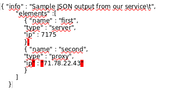
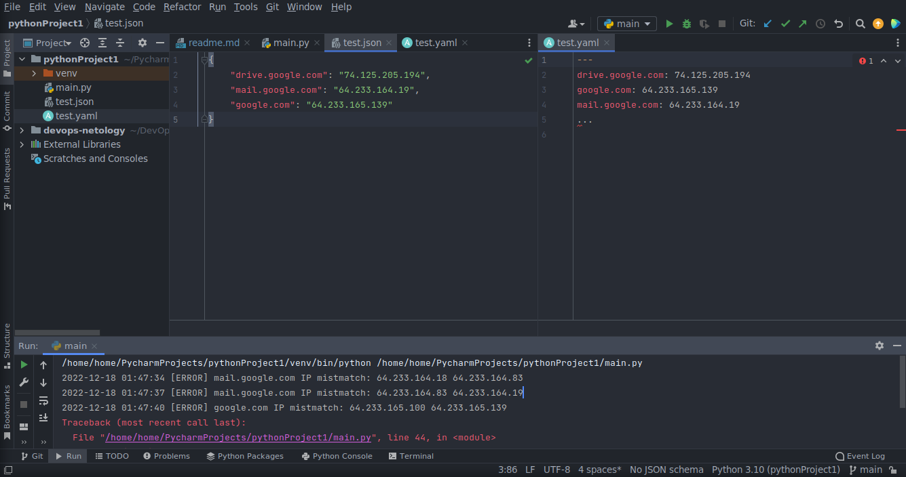

# Домашнее задание к занятию "4.3. Языки разметки JSON и YAML"

---

## Задание 1

## Обязательная задача 1

Мы выгрузили JSON, который получили через API запрос к нашему сервису:

```
    { "info" : "Sample JSON output from our service\t",
        "elements" :[
            { "name" : "first",
            "type" : "server",
            "ip" : 7175 
            }
            { "name" : "second",
            "type" : "proxy",
            "ip : 71.78.22.43
            }
        ]
    }
```

Нужно найти и исправить все ошибки, которые допускает наш сервис

### Ваш скрипт:

Добавил недостающие символы. Выделили их красным цветом.



---

## Задание 2

В прошлый рабочий день мы создавали скрипт, позволяющий опрашивать веб-сервисы и получать их IP. К уже реализованному функционалу нам нужно добавить возможность записи JSON и YAML файлов, описывающих наши сервисы. Формат записи JSON по одному сервису: `{ "имя сервиса" : "его IP"}`. Формат записи YAML по одному сервису: `- имя сервиса: его IP`. Если в момент исполнения скрипта меняется IP у сервиса - он должен так же поменяться в yml и json файле.

### Ваш скрипт:

```python
#!/usr/bin/env python3

import yaml
import json
import socket
import time as t
import datetime as dt

wait = 3   #задержка между проверки IP
srv = { "drive.google.com" : "0.0.0.0", "mail.google.com" : "0.0.0.0", "google.com" : "0.0.0.0" }

# Формируем словарь текущих значений ip адресов
for host in srv:
    srv[host] = socket.gethostbyname(host)

# Функция записи текущих IP в YAML файл
def wr_yaml (name_file):
    with open(name_file, 'wb') as fw:
        yaml.safe_dump(srv, fw, default_flow_style=False, explicit_start=True, explicit_end=True,
                       allow_unicode=True, encoding='utf-8', indent=2)

# Функция записи текущих IP в JSON файл
def wr_json (name_file):
    with open(name_file, 'w', encoding='utf-8') as f:
        json.dump(srv, f, ensure_ascii=False, indent=4)

wr_yaml('test.yaml')
wr_json('test.json')

out_while = 1
while out_while == 1:
    for host in srv:
        ip = socket.gethostbyname(host)
        if ip != srv[host]:
            print(str(dt.datetime.now().strftime("%Y-%m-%d %H:%M:%S")) + ' [ERROR] ' + str(host) + \
                  ' IP mistmatch: ' + srv[host] + ' ' + ip)
            srv[host] = ip
            wr_yaml('test.yaml')
            wr_json('test.json')
            #out_while = 0  # Если раскомментировать, тогда бесконечный цикл будет прерываться при изменении ip любого
                            # из адресов серверов.
            break
    t.sleep(wait)
```

### Вывод скрипта при запуске при тестировании:

```
~/PycharmProjects/pythonProject1/venv/bin/python ~/PycharmProjects/pythonProject1/main.py
2022-12-18 01:47:34 [ERROR] mail.google.com IP mistmatch: 64.233.164.18 64.233.164.83
2022-12-18 01:47:37 [ERROR] mail.google.com IP mistmatch: 64.233.164.83 64.233.164.19
2022-12-18 01:47:40 [ERROR] google.com IP mistmatch: 64.233.165.100 64.233.165.139
```



### json-файл(ы), который(е) записал ваш скрипт:

```json
(venv) home@home:~/PycharmProjects/pythonProject1$ cat test.yaml
---
drive.google.com: 74.125.205.194
google.com: 64.233.165.139
mail.google.com: 64.233.164.19
```

### yml-файл(ы), который(е) записал ваш скрипт:

```yaml
(venv) home@home:~/PycharmProjects/pythonProject1$ cat test.json
{
    "drive.google.com": "74.125.205.194",
    "mail.google.com": "64.233.164.19",
    "google.com": "64.233.165.139"
}
```

---

## Дополнительное задание (со звездочкой*) - необязательно к выполнению

Так как команды в нашей компании никак не могут прийти к единому мнению о том, какой формат разметки данных использовать: JSON или YAML, нам нужно реализовать парсер из одного формата в другой. Он должен уметь:

* Принимать на вход имя файла
* Проверять формат исходного файла. Если файл не json или yml - скрипт должен остановить свою работу
* Распознавать какой формат данных в файле. Считается, что файлы *.json и *.yml могут быть перепутаны
* Перекодировать данные из исходного формата во второй доступный (из JSON в YAML, из YAML в JSON)
* При обнаружении ошибки в исходном файле - указать в стандартном выводе строку с ошибкой синтаксиса и её номер
* Полученный файл должен иметь имя исходного файла, разница в наименовании обеспечивается разницей расширения файлов

### Ваш скрипт:

На месте проблемного блока сейчас стоит заглушка выдающая сообщение об ошибки.  
Но не говорящая о местонахождении её.  
Остальной функционал реализован.  

```python
#!/usr/bin/env python3

from sys import argv
import os
import sys
from json.decoder import JSONDecodeError
import json

script, in_name_file = argv
# Проверка на наличие файла
cmd = os.getcwd()
if len(in_name_file) >= 2:
    cmd = cmd + "/" + in_name_file
result_find = os.path.isfile(cmd)
if result_find == 0:
    print("Каталог " + os.getcwd() + " не содержит " + in_name_file + " файл")
    exit()
# Проверка по расширению файла
end_file = os.path.splitext(cmd)[1]
for end_fi in [".yaml", ".yml", ".json"]:
    if end_file != end_fi:
        print('Файл не подходящего формата (*.yaml, *.yml, *.json).')
        exit()

# Блок который так и не завершен. Не могу вывести error message JSONDecodeError.
# Пример json.decoder.JSONDecodeError: Expecting property name enclosed in double quotes: line 4 column 5 (char 88)
# Приведенная строка выше как раз отвечает на вопросы по местонаходжению ошибки 
try:
    with open(cmd) as f:
        d = json.load(f)
except json.decoder.JSONDecodeError:
    print('Ошибка в файле ' + in_name_file)
    exit()

# Функция записи текущих IP в YAML файл
def wr_yaml (name_file, srv):
    with open(name_file, 'wb') as fw:
        yaml.safe_dump(srv, fw, default_flow_style=False, explicit_start=True, explicit_end=True,
                       allow_unicode=True, encoding='utf-8', indent=2)

# Функция записи текущих IP в JSON файл
def wr_json (name_file, srv):
    with open(name_file, 'w', encoding='utf-8') as f:
        json.dump(srv, f, ensure_ascii=False, indent=4)

# Чтение файл с помощью yaml, т.к. он может читать и json, и yaml.
with open(cmd) as f:
    date_file = yaml.safe_load(f)

# Перекодирование (JSON->YAML, YAML->JSON) и запись файла в зависимости от типа входного
end_file = os.path.splitext(cmd)[1]
if (end_file == ".yaml") or (end_file == ".yml"):
    wr_json(os.path.splitext(in_name_file)[0]+'.json', date_file)
    exit()
else:
    wr_yaml(os.path.splitext(in_name_file)[0]+'.yaml', date_file)
    exit()
```

### Пример работы скрипта:

???

---
